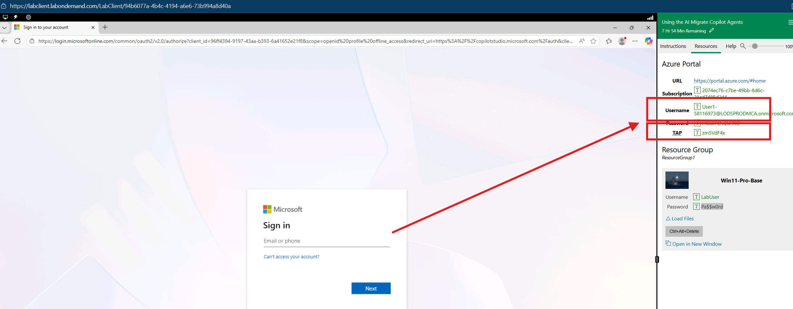
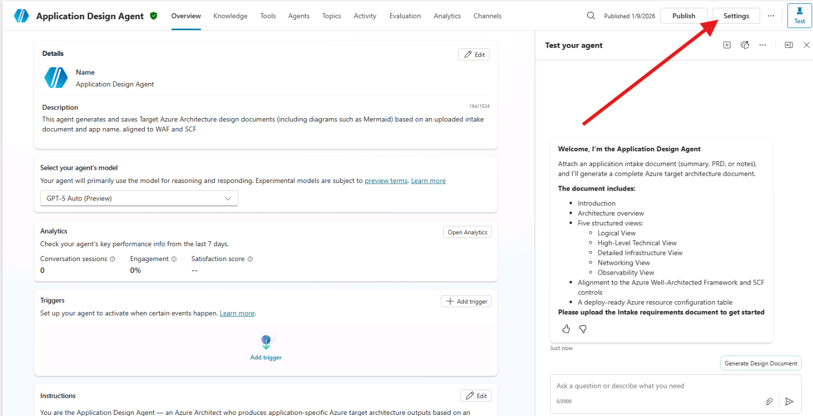

# Design Agent Lab Instructions

## Microsoft Copilot Studio – Azure Architecture Generator

**Version:** 1.0  
**Last Updated:** January 7, 2026  
**Audience:** Microsoft Architects and Consultants  
**Duration:** 90 minutes

---

## 📋 Table of Contents

1. [Lab Overview](#lab-overview)
2. [Prerequisites](#prerequisites)
3. [Module 1: Solution Import](#module-1-solution-import)
4. [Module 2: Connection Configuration](#module-2-connection-configuration)
5. [Module 3: Knowledge Base Setup](#module-3-knowledge-base-setup)
6. [Module 4: Using the Design Agent (Interactive Mode)](#module-4-using-the-design-agent-interactive-mode)
7. [Module 5: Autonomous Agent Mode](#module-5-autonomous-agent-mode)
8. [Module 6: Topic Walkthrough – Generate and Save Azure Architecture Doc](#module-6-topic-walkthrough--generate-and-save-azure-architecture-doc)
9. [Module 7: Understanding the Output](#module-7-understanding-the-output)
10. [Module 8: Publishing to Channels](#module-8-publishing-to-channels)
11. [Appendix: Troubleshooting](#appendix-troubleshooting)

---

## Lab Overview

### Introduction

The **Design Agent** is a Microsoft Copilot Studio–built architecture generator that leverages deep-reasoning capabilities (GPT-5 Reasoning model) to transform application intake data into comprehensive Azure architectural designs. This solution enables rapid generation of baseline Azure architectures, significantly accelerating the design phase of cloud migration and modernization engagements.

### What You Will Learn

By the end of this lab, you will be able to:

- ✅ Import the Design Agent solution into your Copilot Studio environment
- ✅ Configure required connections (SharePoint, Email, Power Automate)
- ✅ Upload and configure knowledge base files
- ✅ Generate complete Azure architecture documents from intake data
- ✅ Understand the five standardized architecture views
- ✅ Interpret the Azure Resource Configuration tables

### Key Capabilities

The Design Agent produces:

| Output | Description |
|--------|-------------|
| **Formal Introduction** | Application overview and context |
| **Data Flows** | Main data movement and processing patterns |
| **Architecture Overview** | High-level technical summary |
| **Five Architecture Views** | Logical, High-Level Technical, Detailed Infrastructure, Networking, Observability |
| **Rationales** | Design decisions aligned with WAF and SCF |
| **Resource Configuration Table** | Deployment-ready Azure resource specifications |

---

## Prerequisites

### Required Access

- [ ] Microsoft 365 account with Copilot Studio license
- [ ] Power Platform environment with Dataverse
- [ ] SharePoint site for document storage
- [ ] Power Automate premium connectors access
- [ ] GPT-5 Reasoning (Preview) model access in Copilot Studio

### Required Files

- [ ] Design Agent solution package (`.zip` file)
- [ ] Azure Resource Table Sample.txt (Knowledge file)
- [ ] Sample intake document (PDF or Word format)

### Environment Setup Checklist

| Component | Status |
|-----------|--------|
| Copilot Studio access | ⬜ Verified |
| Power Platform environment | ⬜ Created |
| SharePoint document library | ⬜ Configured |
| Email connector | ⬜ Available |

#### Step 0: SahrePoint Site Configuration
---

## Module 1: Solution Import (10 minutes)

### Step 1.1: Access Copilot Studio (1 minute)

1. Navigate to [https://copilotstudio.microsoft.com](https://copilotstudio.microsoft.com)
2. Sign in with your Microsoft 365 credentials



Select United States, wait until the agent comes up and Refresh the page


1. Select your target **Power Platform environment** from the environment picker in the top-right corner

> 💡 **Tip:** Ensure you select an environment where you have System Administrator or Environment Maker privileges.

### Step 1.2: Navigate to Solutions (1 minute)

1. Refresh page and click on Copilot Studio icon 


2. In the left navigation pane, click on **Solutions**
3. If Solutions is not visible, click **More** (•••) to expand the menu

### Step 1.3: Import the Solution (5 minutes)


#### Step 1.3.1: Import Intake agent

1. Click **Import solution** from the command bar
2. Click **Browse** select the Design Agent solution package (`AIMigrateIntakeAgent_1_0_0_7.zip` file)


3. Click **Open**
4. Click **Next**
5. Click **Next**
6. When green check is in all services then click **Import**


#### Step 1.3.2: Import Design agent

1. Click **Import solution** from the command bar
2. Click **Browse** select the Design Agent solution package (`.zip` file)


3. Click **Open**
4. Click **Next**
5. Click **Next**
6. When green check is in all services then click **Import**


**5. Wait until the solution is imported**


**Both solution are imported with warnings**


### Step 1.4: Configure Import Settings (2-5 minutes)
### Step 1.4.1: Configure Intake Agent Settings
1. Select the Intake Agent and click **Settings**


1.4.1.a: Outlook (Email) Connection — Required
The agent needs Outlook to send the intake summary as an email with a JSON payload (and optional HTML summary). Setup Steps

In Copilot Studio → Data → Connections, ensure Office 365 Outlook is connected.
(Recommended) Use a shared mailbox (e.g., migration-intake@contoso.com) to avoid sending from an individual account.
Ensure the connection user has Send As rights if you plan to set the From field to the shared mailbox.
In the agent’s Action/Flow that sends email:
Set To = your migration team DL or mailbox (from environment variable)
Optionally set From (Send As) = shared mailbox address
Subject template: Azure Migration Intake – <Application Name> – <Date>
Body: include JSON attachment and a human-friendly HTML summary (optional)
⚠️ Important: Email will be sent from the account backing the Outlook connection unless a shared mailbox and Send As are configured.

### Step 1.4.2: Configure Design Agent Settings
1. Review the solution components:
   - Agent: Application Design Agent
   - Topics (flows and conversation logic)
   - Power Automate cloud flows
   - Connection references

2. For each **Connection Reference**, you will need to either:
   - Select an existing connection, OR
   - Create a new connection (covered in Module 2)

3. Click **Import**

> ⏱️ **Note:** The import process may take 5-10 minutes depending on the solution size.

### Step 1.5: Verify Import Success (1 minute)

1. Once imported, locate **Application Design Agent** in your Agents list
2. Click to open the agent
3. Verify the agent overview displays correctly:

**Expected Overview Screen:**


## Module 2: Connection Configuration

After importing the solution, you must establish connections for the agent to function correctly.

### Step 2.1: Identify Required Connections (2-5 minutes)

The Design Agent requires the following connections:

| Connection | Purpose |
|------------|---------|
| **SharePoint** | Store and retrieve intake documents and generated architectures |
| **Office 365 Outlook** | Send generated documents via email |
| **Microsoft Learn Docs MCP** | Knowledge |

In Copilot Studio, navigate to **Settings** > **Connections**




### Step 2.2: Configure SharePoint Connection (1 minute)

1. Locate the **Save Design Document** connection reference
2. Click **Connect**
3. Sign in with credentials that have access to your target SharePoint site
4. Grant the required permissions when prompted
5. Click **Create**


**SharePoint Site Configuration:**

```
Site URL: https://[tenant].sharepoint.com/sites/[YourDesignAgentSite]
Document Library: Architecture Documents
```

### Step 2.3: Configure Email Connection (1 minute)

1. Locate the **Office 365 Outlook** connection reference
2. Click **Connect**


3. Verify Authenticate with your organizational email account
4. Click **Submit**


### Step 2.4: Verify All Connections (''20)

1. Navigate to **Power Platform Admin Center** > **Connections**
2. Verify all connections show **Connected** status:

| Connection | Status |
|------------|--------|
| SharePoint | ✅ Connected |
| Office 365 Outlook | ✅ Connected |
| Dataverse | ✅ Connected |


### Step 2.5: Review Flow Connections (30 seconds)

1. Open **Power Automate** ([https://make.powerautomate.com](https://make.powerautomate.com))
2. Navigate to **Flows**
3. Review connection references:
   - **Save Design Document** - SharePoint connection
   - **ExtractDocumentText** – SharePoint connection
   - **Invoke Design Agent** - Sharepoint, Copilot Studio connection
   - **SaveArchitectureDocument** – SharePoint, Outlook connections


---

## Module 3: Knowledge Base Setup

The Design Agent uses a knowledge file to ensure output structure matches deployment requirements.

### Step 3.1: Navigate to Knowledge (30 seconds)

1. In Copilot Studio, open the **Application Design Agent**
2. Click the **Knowledge** tab in the top navigation

### Step 3.2: Review Existing Knowledge (Last time 1/12/2026 12:00 pm 50 minutes)

The agent should have:

| Knowledge Source | Status |
|------------------|--------|
| Azure Guidance.txt | ✅ Ready |

> 📄 **Knowledge File Purpose:** This text-based file guides the agent to produce resource configuration tables in a format compatible with the deployment agent.

### Step 3.3: Add Additional Knowledge (Optional)

To add custom knowledge sources:

1. Click **+ Add knowledge**
2. Select source type:
   - **Files** – Upload PDF, Word, or text documents
   - **SharePoint** – Connect to document libraries
   - **Public website** – Enable web search (if required)

3. Upload your file and wait for processing to complete
4. Verify status shows **Ready**

### Step 3.4: Configure Web Search (Optional)

Web Search allows the agent to reference public documentation:

```
Web Search: Disabled (Recommended for secure environments)
```

> ⚠️ **Security Note:** Keep Web Search disabled for engagements involving sensitive customer data.

---

## Module 4: Using the Design Agent (Interactive Mode)

The Design Agent supports two operational modes: **Interactive Mode** (covered in this module) and **Autonomous Mode** (covered in Module 5). This module focuses on the interactive conversation-based approach.

### Step 4.1: Test the Agent

1. In the agent overview, locate the **Test your agent** panel on the right side
2. Review the agent's welcome message:

```
**Welcome, I'm the Application Design Agent**
Attach an application intake document (summary, PRD, or notes), and I’ll generate a complete Azure target architecture document.
*The document includes:*
IntroductionArchitecture overviewFive structured views:Logical ViewHigh-Level Technical ViewDetailed Infrastructure ViewNetworking ViewObservability ViewAlignment to the Azure Well-Architected Framework and SCF controlsA deploy-ready Azure resource configuration tablePlease upload the Intake requirements document to get started


Suggested Trigger Phrase Line:
1. Generates a target Azure architecture design document for a given application.
2. Generate and save target Azure architecture
```

### Step 4.2: Prepare Your Intake Document

Before using the agent, ensure your intake document contains:

- [ ] Application name and description
- [ ] Business requirements
- [ ] Technical requirements
- [ ] Compliance requirements (GDPR, CCPA, etc.)
- [ ] Performance and scalability needs
- [ ] Integration requirements
- [ ] Security requirements

**Sample Intake Document Structure:**

```
Application Name: SmartLogistics
Business Criticality: High/Mission Critical
Regions: Primary - eastus2, Failover - westeurope
Compliance: GDPR, CCPA

Requirements:
- Real-time GPS telemetry processing
- Integration with SAP ERP
- Mobile and web client support
- 24x7 operations support
```

### Step 4.3: Generate Architecture Document

1. In the test panel, type one of the trigger phrases:
   ```
   Generate target Azure architecture details for the attached Application
   ```

2. When prompted, click **Add content** (📎 attachment icon)

3. **Upload the intake document:**
   - Click **Browse** or drag and drop your file
   - Supported formats: PDF, DOCX, TXT
   - Select your intake document
   - Click **Open**

4. Enter the application name when prompted:
   ```
   SmartLogistics
   ```

5. Wait for the agent to process (Average duration: ~71 seconds)

6. Don't move from the window until the response is completed

### Step 4.4: Review Generated Output

The agent will generate a comprehensive architecture document with the following structure:

**Document Structure:**

```
📦 [AppName] — Target Azure Architecture Details

├── 📋 Introduction
├── 🔄 Data Flows  
├── 🏗️ Architecture Overview
├── 📐 Detailed Description of Each View
│   ├── 1) Logical View — Conceptual
│   ├── 2) High-Level Technical View
│   ├── 3) Detailed Infrastructure View
│   ├── 4) Networking View
│   └── 5) Observability View
├── 📝 Rationales
├── ⚠️ Limitations
└── 📊 Azure Resource Table
```

---

## Module 5: Autonomous Agent Mode

The Design Agent can operate as a fully autonomous agent, automatically processing intake documents without user intervention. This mode is ideal for high-volume environments or when architects want to batch-process multiple application assessments.

### Step 5.1: Understanding Autonomous Mode

In Autonomous Mode, the agent:

```
┌─────────────────────────────────────────────────────────────────┐
│                    AUTONOMOUS WORKFLOW                           │
├─────────────────────────────────────────────────────────────────┤
│                                                                  │
│  ┌──────────────────┐                                           │
│  │ 📁 SharePoint    │ ← Intake document uploaded to             │
│  │    Intake Folder │   designated folder                       │
│  └────────┬─────────┘                                           │
│           │                                                      │
│           ▼ (Trigger)                                           │
│  ┌──────────────────┐                                           │
│  │ 🤖 Design Agent  │ ← Automatically activated                 │
│  │    Triggered     │                                           │
│  └────────┬─────────┘                                           │
│           │                                                      │
│           ▼                                                      │
│  ┌──────────────────┐                                           │
│  │ 📄 Extract       │ ← App name extracted from filename        │
│  │    Document Data │   or document metadata                    │
│  └────────┬─────────┘                                           │
│           │                                                      │
│           ▼                                                      │
│  ┌──────────────────┐                                           │
│  │ 🏗️ Generate      │ ← Full architecture document              │
│  │    Architecture  │   created automatically                   │
│  └────────┬─────────┘                                           │
│           │                                                      │
│           ▼                                                      │
│  ┌──────────────────┐                                           │
│  │ 💾 Save to       │ ← Output stored in designated             │
│  │    SharePoint    │   output folder                           │
│  └────────┬─────────┘                                           │
│           │                                                      │
│           ▼                                                      │
│  ┌──────────────────┐                                           │
│  │ 📧 Email         │ ← Notification sent to                    │
│  │    Notification  │   stakeholders                            │
│  └──────────────────┘                                           │
│                                                                  │
└─────────────────────────────────────────────────────────────────┘
```

### Step 5.2: Configure SharePoint Intake Folder

#### 5.2.1 Create the Folder Structure

Set up the following folder structure in your SharePoint document library:

```
📁 Design Agent Documents
├── 📁 Intake                    ← Upload intake documents here
│   └── 📄 [AppName]-Intake.pdf
├── 📁 Generated Architectures   ← Output documents stored here
│   └── 📄 [AppName]-Target-Azure-Architecture-v1.0.md
└── 📁 Archive                   ← Processed intake documents moved here
```

#### 5.2.2 Configure SharePoint Site Settings

1. Navigate to your SharePoint site
2. Go to **Site Settings** > **Site Contents**
3. Open the **Design Agent Documents** library
4. Click **⚙️ Settings** > **Library settings**
5. Under **Columns**, ensure the following metadata columns exist:

| Column Name | Type | Purpose |
|-------------|------|--------|
| Application Name | Single line of text | Stores extracted app name |
| Processing Status | Choice | Pending, Processing, Completed, Failed |
| Processed Date | Date and Time | Timestamp of processing |
| Generated Document | Hyperlink | Link to output document |

### Step 5.3: Configure the SharePoint Trigger

#### 5.3.1 Access Triggers Configuration

1. In Copilot Studio, open the **Application Design Agent**
2. In the agent overview, locate the **Triggers** section
3. Click **+ Add trigger**

#### 5.3.2 Set Up SharePoint File Upload Trigger

1. Select **When a file is created (SharePoint)**
2. Configure the trigger settings:

```
┌─────────────────────────────────────────────────────────────────┐
│  TRIGGER CONFIGURATION                                           │
├─────────────────────────────────────────────────────────────────┤
│                                                                  │
│  Trigger Type:     When a file is created in SharePoint         │
│                                                                  │
│  Site Address:     https://[tenant].sharepoint.com/sites/       │
│                    DesignAgentSite                              │
│                                                                  │
│  Library Name:     Design Agent Documents                       │
│                                                                  │
│  Folder Path:      /Intake                                      │
│                                                                  │
│  File Filter:      *.pdf, *.docx, *.txt                        │
│                                                                  │
└─────────────────────────────────────────────────────────────────┘
```

3. Click **Save**

### Step 5.4: Automatic Data Extraction

When triggered autonomously, the agent extracts information without user intervention:

#### 5.4.1 Application Name Extraction

The agent extracts the application name using the following priority:

| Priority | Source | Example |
|----------|--------|--------|
| 1 | File name pattern | `SmartLogistics-Intake.pdf` → "SmartLogistics" |
| 2 | Document metadata | Title property in PDF/DOCX |
| 3 | Document content | First heading or "Application Name:" field |

**File Naming Convention:**
```
[ApplicationName]-Intake.[extension]
[ApplicationName]-Application-Intake-Summary.[extension]
[ApplicationName]-PRD.[extension]
```

#### 5.4.2 Intake Content Extraction

The Power Automate flow **ExtractDocumentText** automatically:

1. Retrieves the file from SharePoint
2. Extracts text content using AI Builder or document parsing
3. Passes the content to the Design Agent for processing

### Step 5.5: Automatic Document Generation and Storage

#### 5.5.1 Generation Process

Once triggered, the agent:

1. Processes the intake document through all generation nodes
2. Creates the complete architecture document with all five views
3. Generates the Azure Resource Configuration table

#### 5.5.2 Output Storage

The generated document is automatically saved to SharePoint:

```
Output Location: /Design Agent Documents/Generated Architectures/
File Name:       [AppName]-Target-Azure-Architecture-v1.0.md
Format:          Markdown with embedded Mermaid diagrams
```

**Metadata Updated:**
- Processing Status → "Completed"
- Processed Date → Current timestamp
- Generated Document → Link to output file

### Step 5.6: Email Notification Configuration

#### 5.6.1 Configure Email Recipients

The agent sends email notifications upon completion. Configure recipients in the Power Automate flow:

1. Open **Power Automate** ([https://make.powerautomate.com](https://make.powerautomate.com))
2. Navigate to **Solutions** > **Design Agent**
3. Open the **SendArchitectureNotification** flow
4. Edit the **Send an email (V2)** action:

```
┌─────────────────────────────────────────────────────────────────┐
│  EMAIL NOTIFICATION SETTINGS                                     │
├─────────────────────────────────────────────────────────────────┤
│                                                                  │
│  To:          @{triggerBody()?['RequestorEmail']}               │
│               architect-team@contoso.com                        │
│                                                                  │
│  CC:          engagement-manager@contoso.com                    │
│                                                                  │
│  Subject:     ✅ Azure Architecture Generated: [AppName]        │
│                                                                  │
│  Body:        [See template below]                              │
│                                                                  │
│  Attachments: [Generated Architecture Document]                 │
│                                                                  │
│  Importance:  Normal                                            │
│                                                                  │
└─────────────────────────────────────────────────────────────────┘
```

#### 5.6.2 Email Template

The notification email includes:

```
━━━━━━━━━━━━━━━━━━━━━━━━━━━━━━━━━━━━━━━━━━━━━━━━━━━━━━━━━━━━━━━━━
📧 EMAIL NOTIFICATION TEMPLATE
━━━━━━━━━━━━━━━━━━━━━━━━━━━━━━━━━━━━━━━━━━━━━━━━━━━━━━━━━━━━━━━━━

Subject: ✅ Azure Architecture Generated: [AppName]

━━━━━━━━━━━━━━━━━━━━━━━━━━━━━━━━━━━━━━━━━━━━━━━━━━━━━━━━━━━━━━━━━

Hello,

The Design Agent has successfully generated a target Azure 
architecture document for the following application:

📦 Application:     [AppName]
📅 Generated:       [Timestamp]
📁 Source Document: [Intake Document Name]

━━━━━━━━━━━━━━━━━━━━━━━━━━━━━━━━━━━━━━━━━━━━━━━━━━━━━━━━━━━━━━━━━

📄 Generated Document Details:

• Document Location: [SharePoint Link]
• Views Included: Logical, High-Level Technical, Detailed 
  Infrastructure, Networking, Observability
• Resource Table: Included (Markdown + Plain Text)

━━━━━━━━━━━━━━━━━━━━━━━━━━━━━━━━━━━━━━━━━━━━━━━━━━━━━━━━━━━━━━━━━

⚠️ Next Steps:

1. Review the generated architecture document
2. Validate design decisions with the customer
3. Adjust configurations as needed
4. Forward to the Deployment Agent for infrastructure provisioning

━━━━━━━━━━━━━━━━━━━━━━━━━━━━━━━━━━━━━━━━━━━━━━━━━━━━━━━━━━━━━━━━━

This is an automated message from the Design Agent.
For questions, contact your engagement manager.

━━━━━━━━━━━━━━━━━━━━━━━━━━━━━━━━━━━━━━━━━━━━━━━━━━━━━━━━━━━━━━━━━
```

### Step 5.7: Testing Autonomous Mode

1. **Prepare a test intake document** with proper naming:
   ```
   TestApp-Intake.pdf
   ```

2. **Upload to the Intake folder:**
   - Navigate to SharePoint > Design Agent Documents > Intake
   - Upload the test document

3. **Monitor processing:**
   - Check the **Processing Status** column in SharePoint
   - View Power Automate flow run history for details

4. **Verify outputs:**
   - Check the **Generated Architectures** folder for the output
   - Confirm email notification was received

### Step 5.8: Autonomous Mode Best Practices

| Best Practice | Recommendation |
|---------------|----------------|
| File naming | Use consistent `[AppName]-Intake` pattern |
| Document format | PDF works best for text extraction |
| Batch processing | Upload multiple files; they process sequentially |
| Error handling | Monitor the Archive folder for failed documents |
| Notifications | Configure team distribution list for visibility |

---

## Module 6: Topic Walkthrough – Generate and Save Azure Architecture Doc

This module provides a detailed walkthrough of the main topic flow that powers the Design Agent.

### Step 6.1: Access the Topic

1. In Copilot Studio, open the **Application Design Agent**
2. Click the **Topics** tab in the top navigation
3. Locate and click on **"Generate and save Azure architecture doc"**

### Step 6.2: Understanding the Topic Flow

The topic consists of several key components arranged in a logical flow:

```
┌─────────────────────────────────────────────────────────────────┐
│                        TOPIC FLOW DIAGRAM                        │
├─────────────────────────────────────────────────────────────────┤
│                                                                  │
│  ┌─────────┐                                                    │
│  │ Trigger │ ← "The agent chooses"                              │
│  └────┬────┘   Generates a target Azure architecture design...  │
│       │                                                          │
│       ▼                                                          │
│  ┌────────────────────┐                                         │
│  │ Set variable value │ ← Initialize variablesText = ""         │
│  └────────┬───────────┘                                         │
│           │                                                      │
│       ┌───┴───┐                                                 │
│       ▼       ▼                                                  │
│  ┌─────────┐  ┌──────────────────┐                              │
│  │Condition│  │All other conditions│                            │
│  │varApp   │  │                    │                            │
│  │is Blank │  │Set variablesText = │                            │
│  └────┬────┘  │"ActivityText"      │                            │
│       │       └────────────────────┘                            │
│       ▼                                                          │
│  ┌──────────┐                                                   │
│  │ Question │ ← "Enter the App Name"                            │
│  │ Identity:│   Save response as: var1 (string)                 │
│  │ User's   │                                                   │
│  │ entire   │                                                   │
│  │ response │                                                   │
│  └────┬─────┘                                                   │
│       │                                                          │
│       ▼                                                          │
│  ┌────────────────────┐                                         │
│  │ Set variable value │ ← varApp = var1                         │
│  └────────┬───────────┘                                         │
│           │                                                      │
│           ▼                                                      │
│  ┌──────────┐                                                   │
│  │ Question │ ← "Please upload the intake requirements..."      │
│  │ Identity:│   Save response as: varFile (record)              │
│  │ File     │                                                   │
│  └────┬─────┘                                                   │
│       │                                                          │
│       ▼                                                          │
│  ┌──────────────────────────┐                                   │
│  │ Action                   │                                   │
│  │ Power Automate Input(s): │                                   │
│  │   NoContent (Record) ←   │                                   │
│  │   varFile: record        │                                   │
│  │                          │                                   │
│  │ ┌──────────────────────┐ │                                   │
│  │ │ ExtractDocumentText  │ │                                   │
│  │ │ View flow details    │ │                                   │
│  │ └──────────────────────┘ │                                   │
│  │                          │                                   │
│  │ Outputs:                 │                                   │
│  │   intakeDocumentN..string│                                   │
│  │   intakeDocumentC..string│                                   │
│  └────────┬─────────────────┘                                   │
│           │                                                      │
│           ▼                                                      │
│  ┌────────────────────┐                                         │
│  │ Set variable value │ ← variablesText = intakeDocumentC...    │
│  └────────┬───────────┘                                         │
│           │                                                      │
└───────────┼─────────────────────────────────────────────────────┘
            │
            ▼
        [Continued in Step 5.3]
```

### Step 6.3: Generation Nodes

After document extraction, the flow continues with a series of generation nodes:

```
┌─────────────────────────────────────────────────────────────────┐
│                    GENERATION NODES                              │
├─────────────────────────────────────────────────────────────────┤
│                                                                  │
│  ┌───────────────────────────┐                                  │
│  │ 🤖 GenerateIntroAndOverview│                                  │
│  │   Input: varApp (string)   │                                  │
│  │   Data source: Text        │                                  │
│  └────────────┬──────────────┘                                  │
│               │                                                  │
│               ▼                                                  │
│  ┌───────────────────────────┐                                  │
│  │ 🤖 GenerateDataFlows       │                                  │
│  │   Input: varApp (string)   │                                  │
│  │   Data source: Text        │                                  │
│  └────────────┬──────────────┘                                  │
│               │                                                  │
│               ▼                                                  │
│  ┌───────────────────────────┐                                  │
│  │ 🤖 GenerateDetailedViews   │                                  │
│  │   Input: varApp (string)   │                                  │
│  │   Data source: Text        │                                  │
│  └────────────┬──────────────┘                                  │
│               │                                                  │
│               ▼                                                  │
│  ┌───────────────────────────┐                                  │
│  │ 🤖 GenerateRationale       │                                  │
│  │   Input: varApp (string)   │                                  │
│  │   Data source: Text        │                                  │
│  └────────────┬──────────────┘                                  │
│               │                                                  │
│               ▼                                                  │
│  ┌───────────────────────────┐                                  │
│  │ 🤖 GenerateAzureResourceTable│                                │
│  │   Input: varApp (string)   │                                  │
│  │   Data source: Text        │                                  │
│  └────────────┬──────────────┘                                  │
│               │                                                  │
│               ▼                                                  │
│  ┌───────────────────────────┐                                  │
│  │ Set variable value        │                                  │
│  │   varArchitectureDoc =    │                                  │
│  │   [Combined outputs]      │                                  │
│  └────────────┬──────────────┘                                  │
│               │                                                  │
│               ▼                                                  │
│         [Save/Send Flow]                                        │
│                                                                  │
└─────────────────────────────────────────────────────────────────┘
```

### Step 6.4: Key Topic Components Explained

#### 6.4.1 Trigger Node
- **Type:** Agent-initiated trigger
- **Description:** "Generates a target Azure architecture design document for a given application"
- **Activation:** The agent chooses when to invoke this topic based on user intent

#### 6.4.2 Variable Initialization
```
Set variable: variablesText
To value: ""
```
Initializes the text variable that will hold the intake document content.

#### 6.4.3 Condition Node
Checks if the application name (`varApp`) is already provided:
- **If Blank:** Prompts user for the application name
- **All Other Conditions:** Proceeds with existing value

#### 6.4.4 Question Nodes

**Application Name Question:**
```
Prompt: "Enter the App Name"
Identity: User's entire response
Save as: var1 (string)
```

**File Upload Question:**
```
Prompt: "Please upload the intake requirements..."
Identity: File
Save as: varFile (record)
```

#### 6.4.5 ExtractDocumentText Action
This Power Automate flow:
- **Input:** `varFile` (the uploaded document)
- **Process:** Extracts text content from PDF/DOCX
- **Outputs:**
  - `intakeDocumentName` (string) – File name
  - `intakeDocumentContent` (string) – Extracted text

#### 6.4.6 Generation Prompts
Each generation node uses the GPT-5 Reasoning model with specific prompts:

| Node | Purpose | Output |
|------|---------|--------|
| GenerateIntroAndOverview | Creates introduction and architecture overview | Markdown content |
| GenerateDataFlows | Documents data movement patterns | Markdown content |
| GenerateDetailedViews | Produces the five architecture views with Mermaid diagrams | Markdown + Mermaid |
| GenerateRationale | Explains design decisions | Markdown content |
| GenerateAzureResourceTable | Creates resource configuration table | Markdown table + plain text |

### Step 6.5: Modifying the Topic

To customize the topic for specific customer needs:

1. **Click on any node** to view its properties
2. **Edit prompts** by clicking the prompt text in generation nodes
3. **Add conditions** by clicking **+** between nodes
4. **Add actions** to integrate with additional Power Automate flows

**Common Customizations:**

| Customization | How To |
|---------------|--------|
| Add additional views | Duplicate a generation node and modify the prompt |
| Change output format | Edit the generation prompt to specify format requirements |
| Add approval workflow | Insert a Power Automate action before save |
| Email to multiple recipients | Modify the save/send flow in Power Automate |

---

## Module 7: Understanding the Output

### Step 7.1: Introduction Section

The generated document begins with a formal introduction:

```markdown
# 📦 SmartLogistics — Target Azure Architecture Details

**Prepared for:** [Consultant Name]
**Regions:** primary eastus2, failover westeurope
**Compliance focus:** GDPR and CCPA
**Business criticality:** High mission critical

---

## 🧭 Introduction

SmartLogistics is a cloud-first logistics platform that provides 
real-time shipment tracking, analytics, and deep...
```

### Step 7.2: Data Flows Section

Documents the main data movement patterns:

```markdown
## 🔄 Data Flows

Real-time GPS telemetry is ingested through secure APIs and streaming 
endpoints, normalized, and persisted in a document database optimized 
for operational reads and writes. Operational dashboards and mobile 
clients consume this data via secure APIs with WebSockets for 
low-latency updates. Nightly batch pipelines extract operational 
data to an analytical store for historical analysis and reporting.

Enterprise integration uses private connectivity to ERP and corporate 
services. Secrets and keys are centrally managed, with encryption in 
transit and at rest by default. Observability signals flow to a unified 
logging and SIEM layer to support 24x7 operations and incident response.
```

### Step 7.3: Architecture Views

The agent generates five standardized architecture views:

#### View 1: Logical View — Conceptual

**Purpose:** Non-technical summary showing core actors and systems without binding to specific Azure services.

**Key Elements:**
- Trust boundaries (Cloud Provider Zone, Internet Zone, Corporate Network)
- Actor representations (End Users, GPS Providers, Enterprise Systems)
- Logical component flows
- Communication protocols (HTTPS:443, WebSockets, Kafka:9093)

**Description:**
> This conceptual view illustrates the core actors and systems without binding them to specific Azure services. Internet users access the solution via a web or mobile client, which communicates with a web gateway that enforces security and routes traffic to the API gateway.

#### View 2: High-Level Technical View

**Purpose:** Shows Azure components and their integrations at a technical level.

**Key Elements:**
- Azure service selections
- Integration patterns
- Technology rationale

#### View 3: Detailed Infrastructure View

**Purpose:** Provides infrastructure-level detail for resource isolation and SCF controls.

**Key Elements:**
- Resource boundaries
- SCF control mapping
- Security configurations

#### View 4: Networking View

**Purpose:** Illustrates virtual network connectivity and segmentation.

**Key Elements:**
- Hub-spoke network topology
- Trust boundary implementation
- Network security groups

#### View 5: Observability View

**Purpose:** Presents logging and monitoring strategy.

**Key Elements:**
- Application Insights integration
- Log Analytics workspace
- Azure Sentinel SIEM

### Step 7.4: Rationales Section

Explains design decisions aligned with best practices:

```markdown
## 📝 Rationales

**Security and Compliance:** The design adopts a zero trust posture with 
identity-driven access, Private Link for data plane isolation, and 
centralized egress via Azure Firewall. All traffic is TLS encrypted and 
governed by WAF policies at both the global and regional layers. GDPR and 
CCPA controls are supported through encryption at rest with customer-managed 
keys in Key Vault and Managed HSM, data minimization in analytics, and 
role-based access to sensitive data.

**Scalability and Availability:** Azure Front Door and regionally deployed 
services enable active-active or active-passive failover between eastus2 
and westeurope. Event Hubs partitions and Cosmos DB throughput allocation 
support bursty telemetry. App Service autoscale handles variable traffic, 
while the hub-spoke network isolates fault domains and enables independent 
scaling of app and data planes.

**Operations and Cost:** PaaS services reduce patching and maintenance 
overhead, letting the team focus on features. Centralized monitoring with 
Application Insights and Sentinel improves mean time to detect and remediate. 
API Management policies standardize throttling, caching, and transformation, 
reducing custom code and improving observability.
```

### Step 7.5: Azure Resource Table

The final section provides deployment-ready resource specifications:

```markdown
## 📊 Azure Resource Table — Visual

| Resource Name | Resource Type | SKU | Regions |
|---------------|---------------|-----|---------|
| FrontDoor-Global | Front-Door-Standard-Premium | standard-premium | global |
| DDoS-Plan-Hub | DDoS-Protection-Plan | standard | eastus2-westeurope |
| Hub-VNet | Virtual-Network | n-a | eastus2 |
| AzureFirewall-Hub | Azure-Firewall-Premium | premium | eastus2-westeurope |
| ExpressRoute-Gateway | Virtual-Network-Gateway | er-gateway | eastus2 |
| Bastion-Host | Azure-Bastion | standard | eastus2 |
| AppSpoke-VNet | Virtual-Network | n-a | eastus2-westeurope |
| DataSpoke-VNet | Virtual-Network | n-a | eastus2-westeurope |
```

> 📋 **Note:** The resource table is provided in both Markdown and plain text formats for compatibility with deployment automation tools.

---

## Module 8: Publishing to Channels

Once you have configured and tested the Design Agent, you can publish it to various channels to make it accessible to architects and consultants across your organization.

### Step 8.1: Understanding Channels

Copilot Studio supports publishing to multiple channels:

| Channel | Use Case | Audience |
|---------|----------|----------|
| **Microsoft Teams** | Internal collaboration | Architects, Consultants |
| **SharePoint** | Embedded in project sites | Project teams |
| **Power Apps** | Custom applications | Field consultants |
| **Web (Demo Website)** | External demos | Customer presentations |
| **Azure Bot Service** | Custom integrations | Developers |
| **Microsoft 365 Copilot** | Copilot integration | Enterprise users |

### Step 8.2: Publish the Agent

Before publishing to any channel, you must first publish the agent:

1. In Copilot Studio, open the **Application Design Agent**
2. Click the **Publish** button in the top-right corner
3. Review the publish summary:
   - Topics included
   - Knowledge sources
   - Connections configured
4. Click **Publish**
5. Wait for confirmation: "Your agent is published"

> ⚠️ **Important:** You must republish the agent whenever you make changes to topics, knowledge, or settings.

### Step 8.3: Deploy to Microsoft Teams

Microsoft Teams is the recommended channel for internal use by architects and consultants.

#### 8.3.1 Configure Teams Channel

1. Navigate to **Channels** tab in Copilot Studio
2. Click **Microsoft Teams**
3. Click **Turn on Teams**

#### 8.3.2 Customize Teams App

```
┌─────────────────────────────────────────────────────────────────┐
│  TEAMS APP CONFIGURATION                                         │
├─────────────────────────────────────────────────────────────────┤
│                                                                  │
│  App Name:        Design Agent                                  │
│                                                                  │
│  Short Description:                                             │
│  Generate Azure architecture documents from intake data         │
│                                                                  │
│  Long Description:                                              │
│  The Design Agent uses GPT-5 deep reasoning to transform        │
│  application intake documents into comprehensive Azure          │
│  architecture designs aligned with WAF and SCF.                 │
│                                                                  │
│  App Icon:        [Upload 192x192 PNG]                         │
│  Accent Color:    #0078D4 (Microsoft Blue)                     │
│                                                                  │
│  Developer:       Microsoft Consulting Services                 │
│  Website:         https://microsoft.com/consulting              │
│                                                                  │
└─────────────────────────────────────────────────────────────────┘
```

#### 8.3.3 Set Availability

1. Under **Availability options**, select:
   - ☑️ **Show to my teammates and shared users** (for testing)
   - ☑️ **Show to everyone in my org** (for production)

2. Click **Share**

#### 8.3.4 Admin Approval (If Required)

For organization-wide deployment:

1. Click **Submit for admin approval**
2. Provide business justification
3. Wait for Teams admin approval
4. Once approved, the agent appears in the Teams app store

#### 8.3.5 Using in Teams

Once deployed, users can access the Design Agent:

1. Open **Microsoft Teams**
2. Click **Apps** in the left sidebar
3. Search for "Design Agent"
4. Click **Add** to install
5. Start a conversation with the agent

### Step 8.4: Deploy to SharePoint

Embed the Design Agent in SharePoint sites for easy access from project workspaces.

#### 8.4.1 Get the Embed Code

1. In Copilot Studio, go to **Channels** > **Custom website**
2. Copy the **Embed code**:

```html
<iframe 
  src="https://copilotstudio.microsoft.com/environments/[env]/bots/[botId]/webchat"
  frameborder="0"
  style="width: 100%; height: 600px;">
</iframe>
```

#### 8.4.2 Add to SharePoint Page

1. Navigate to your SharePoint project site
2. Edit the page where you want to embed the agent
3. Add an **Embed** web part
4. Paste the iframe code
5. Adjust dimensions as needed
6. **Publish** the page

### Step 8.5: Deploy as Power Apps Component

Integrate the Design Agent into custom Power Apps for field consultants.

#### 8.5.1 Add Copilot Control

1. Open your Power App in **Power Apps Studio**
2. Insert a **Copilot** control from the Insert menu
3. Configure the control:
   - Select **Application Design Agent** as the source
   - Set dimensions and position

#### 8.5.2 Configure Context Passing

Pass context from your app to the agent:

```powerfx
// Set initial context for the agent
Copilot1.Context = {
    CustomerName: CustomerDropdown.Selected.Name,
    EngagementId: EngagementIdTextBox.Text,
    PreferredRegion: RegionDropdown.Selected.Value
}
```

### Step 8.6: Deploy to Demo Website

Create a standalone demo website for customer presentations.

#### 8.6.1 Configure Demo Website

1. Go to **Channels** > **Demo website**
2. Click **Copy** to get the demo URL:
   ```
   https://copilotstudio.microsoft.com/environments/[env]/bots/[botId]/webchat
   ```

3. Customize appearance:
   - Welcome message
   - Suggested actions
   - Color theme

#### 8.6.2 Share Demo URL

Share the demo URL with customers for presentations:

> 🔗 **Demo URL:** `https://copilotstudio.microsoft.com/environments/.../webchat`

### Step 8.7: Deploy to Microsoft 365 Copilot (Preview)

For organizations with Microsoft 365 Copilot, the Design Agent can be integrated as a plugin.

#### 8.7.1 Enable Copilot Integration

1. Go to **Channels** > **Microsoft 365 Copilot**
2. Click **Enable**
3. Configure plugin settings:
   - Plugin name: "Design Agent"
   - Description: "Generate Azure architectures"
   - Trigger phrases: "design architecture", "generate Azure design"

#### 8.7.2 User Access

Once enabled, users can invoke the Design Agent from Microsoft 365 Copilot:

```
User: @Design Agent generate an Azure architecture for the attached intake document

Copilot: I'll help you generate an Azure architecture. Let me connect you 
         with the Design Agent...
```

### Step 8.8: Channel Management Best Practices

| Practice | Recommendation |
|----------|----------------|
| Version control | Note published version in channel description |
| Access control | Use Azure AD groups to control channel access |
| Monitoring | Enable analytics for each channel |
| Updates | Communicate changes before republishing |
| Testing | Test in dev channel before production deployment |

### Step 8.9: Post-Publishing Checklist

After publishing to channels, verify:

- [ ] Agent responds correctly in each channel
- [ ] File upload works (where supported)
- [ ] Connections function properly
- [ ] Email notifications are sent
- [ ] SharePoint integration works
- [ ] Analytics are being captured

---

## Appendix: Troubleshooting

### Common Issues and Solutions

#### Issue 1: Agent Not Responding

**Symptoms:** Agent shows "typing" indicator but never responds

**Solutions:**
1. Check Power Automate flow status – ensure all flows are **turned on**
2. Verify connection authentication – connections may have expired
3. Check GPT-5 model availability in your region

#### Issue 2: Document Extraction Fails

**Symptoms:** Error when uploading intake document

**Solutions:**
1. Verify file format is supported (PDF, DOCX, TXT)
2. Check file size is under 10MB
3. Ensure SharePoint connection has read permissions

#### Issue 3: Missing Diagrams

**Symptoms:** Architecture views don't include Mermaid diagrams

**Solutions:**
1. Verify the knowledge file is properly loaded
2. Check that the generation prompt includes diagram instructions
3. Regenerate the document

#### Issue 4: Connection Errors

**Symptoms:** "Connection not found" or authentication errors

**Solutions:**
1. Navigate to **Power Platform Admin Center** > **Connections**
2. Delete and recreate failed connections
3. Update connection references in all Power Automate flows
4. Republish the agent

### Analytics and Monitoring

Monitor agent performance in the **Analytics** section:

| Metric | Description | Target |
|--------|-------------|--------|
| Runs | Total conversations | Trending ↑ |
| Successful runs | Percentage of completions | > 85% |
| Average duration | Time to generate document | < 90 sec |

---

## Summary

Congratulations! You have successfully completed the Design Agent lab. You are now able to:

✅ Import and configure the Design Agent solution  
✅ Establish required connections for SharePoint and email  
✅ Use the agent in **Interactive Mode** for conversation-based architecture generation  
✅ Configure **Autonomous Mode** with SharePoint triggers for automated processing  
✅ Understand automatic document extraction and email notifications  
✅ Generate comprehensive Azure architecture documents  
✅ Understand the five standardized architecture views  
✅ Interpret and use the Azure Resource Configuration tables  
✅ **Publish the agent** to Microsoft Teams, SharePoint, Power Apps, and other channels  

### Next Steps

1. **Practice** generating architectures with different intake documents
2. **Configure** autonomous mode for your team's SharePoint environment
3. **Deploy** the agent to Microsoft Teams for your consulting team
4. **Customize** the agent prompts for specific customer scenarios
5. **Integrate** with your deployment automation pipelines
6. **Share** the generated documents with project stakeholders

---

## Additional Resources

| Resource | Link |
|----------|------|
| Copilot Studio Documentation | [https://learn.microsoft.com/copilot-studio](https://learn.microsoft.com/copilot-studio) |
| Azure Well-Architected Framework | [https://learn.microsoft.com/azure/well-architected](https://learn.microsoft.com/azure/well-architected) |
| Power Automate Documentation | [https://learn.microsoft.com/power-automate](https://learn.microsoft.com/power-automate) |

---

**Document Version:** 1.0  
**Author:** Microsoft Consulting Services  
**Feedback:** Submit issues via your engagement manager

---

*© 2026 Microsoft Corporation. All rights reserved.*
