# Prerequisites (10 minutes)
## Step 1: SharePoint Site Configuration
Let's start this Lab setting the SharePoint site required for this Lab.
Open the Edge browser in the taskbar or in your desktop
1. Click on waffle icon on the left
2. Click on **Microosft 365**
3. Click **Sign in** in the top right:

    

    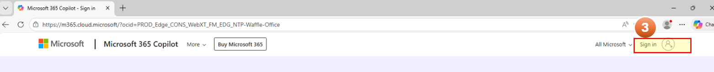

4. Sign in with the username  **Username: +++@lab.CloudPortalCredential(User1).Username+++**
5. Temporary Access Password (TAP) the following value **Temporary Access Pass: +++@lab.CloudPortalCredential(User1).AccessToken+++**

    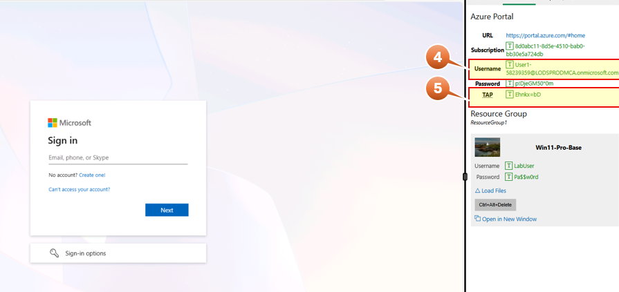

6. On the left pannel, click on Apps
7. SharePoint
8. Open in new tab

    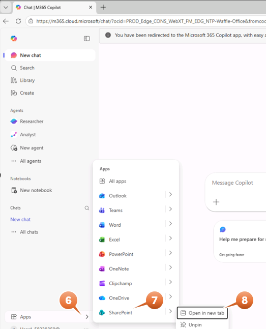

Close the Welcome window

9. Click  **Create site** on the top left
10. Select  **Team site**

    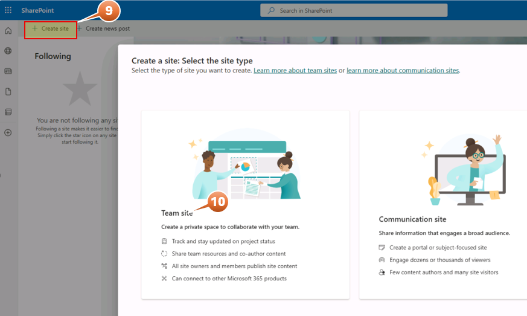

    If window in blank refresh browser

11. Select **Standard team**

    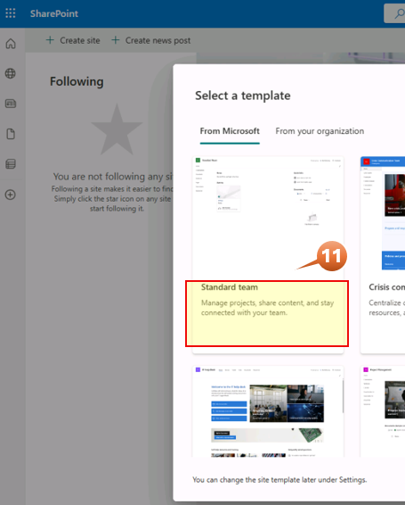

12. Click **Use template**

    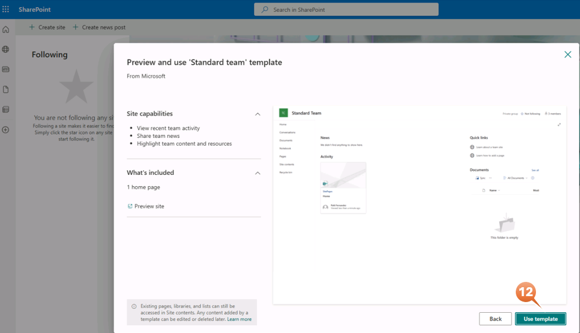

13. Name your site with the truncated name of the user used in this Lab and click on **Next**

    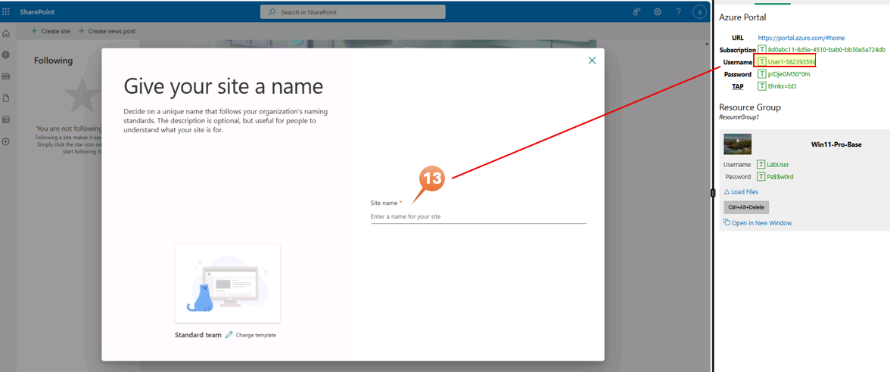

14. Keep *Site Description*, *Group email address* and *Site address* as it is in the window and Click on **Next**

    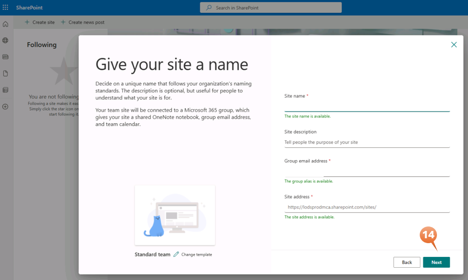

15. Privacy settings, select **Public - anyone in the organization can access this site**
16. Select language, pick **English**
17. Click on **Create site**

    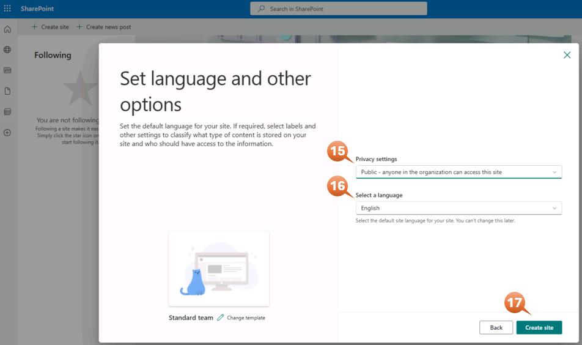

18. Keep the **Add members** box in blank
19. Click on **Finish**

    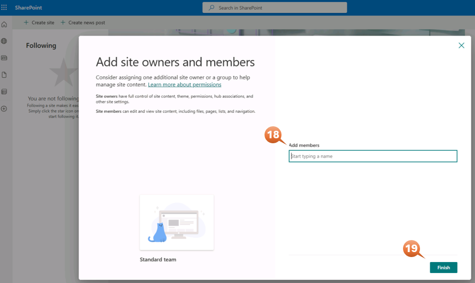

Let's create the Folder Structure for the Automate part of this Lab:

20. Navigate to the left menu and click on **Documents** 
21. On the top right Click **Create or upload**
22. Click **Folder** 
23. Name it +++Intake-Documents+++ (Please don't use different name)
24. Click **Create**

    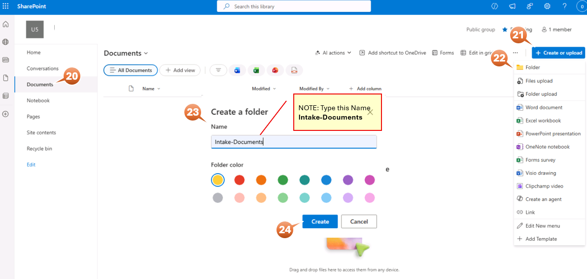

25. On the top right Click **Create or upload** again
26. Click **Folder** 
27. Name it +++Architecture-Documents+++ (Please don't use different name)
28. Click **Create**

    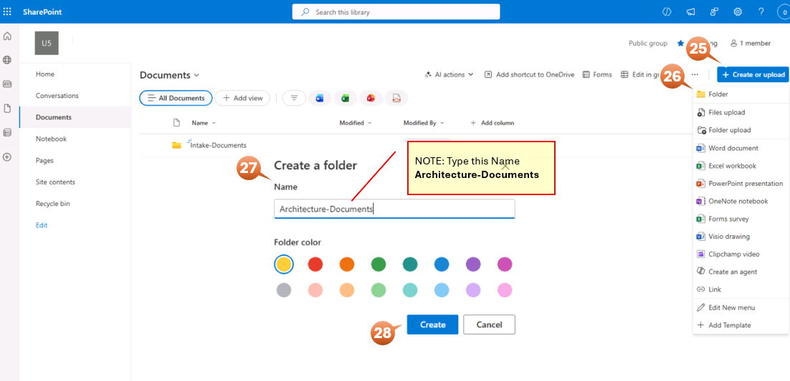

You can keep open the SharePoint tab in the Edge browser
