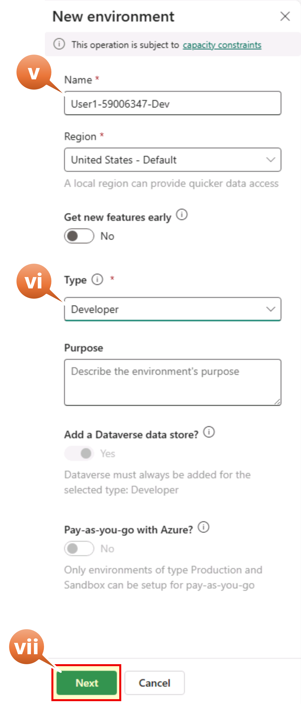
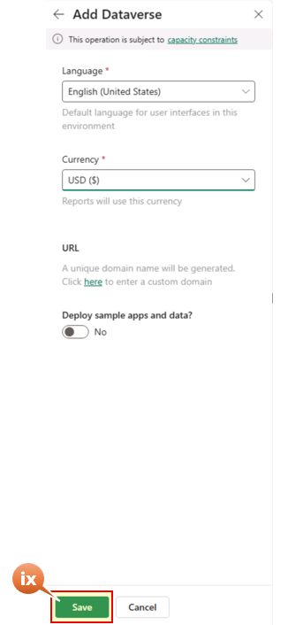
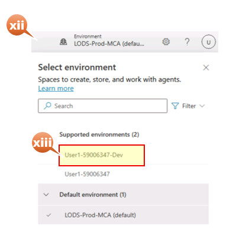

# Module 1: Solution Import (10 minutes)

In this module we'll access to Copilot Studio to Import the Solutions, then we'll review the Settings of the imported

## Step 1: Access Copilot Studio and Import Solutions

1. Open New Tab in the Edge browser
2. Navigate to +++https://copilotstudio.microsoft.com+++
3. Choose United States from the list of country/region
4. Don't Mark **I will receive information, tips, and offers about Microsoft Copilot Studio** checkbox
5. Select **Get Started**

   

6. Skip the Welcome window

## Alternative environment provisioning

Review the Copilot Studio page, if the browser URL contains the default environment URL: "copilotstudio.microsoft.com/environments/**Default-4cfe372a-37a4-44f8-91b2-5faf34253c62**/home", then you might need to create an development environment manually. Follow the following steps to create one manually else skipt to point 7:
- i. Open a New Tab in the Edge browser
- ii. Navigate to +++https://admin.powerplatform.microsoft.com+++
- iii. On the left ribben, select **Manage**
- iv.  Select the **+ New** button
- v. Supply the environment name as your username concatenate with **dev**, as an example **User1-59006347-Dev**
- vi. Select **Developer** as the Type
- vii. Select the **Next** button

   

- viii. Select the **Save** button

   

- ix. Wait for the environment to be fully provisioned
- x. Select the Copilot Studion browser tab and refresh the Page
- xi. In the top left select the Default environment and then
- xii. Select the Environment you have created

   

Now we start the process to import the Solution packages.
Let's start with the **IntakeAgent_1_0_0_7** package

7. On the left ribbon, select the three dots if you don't see the **Solutions**
8. Select **Solutions** (a new tab opens in the Edge browser)

   

9.  Select **Import Solution** from the command bar
10. Select **Browse** to select the solution package to import
11. Select the zip file **IntakeAgent_1_0_0_7.zip** solution package
12. Select **Open**

    

13. Select **Next**
14. Select **Next**
15. When green checks are in all services then Select **Import**

    

Let's continue importing the **DesignAgent_1_0_0_12** package
_Execute the prior steps 12 and 13 again_ and come back to _step 19_

16. Select the zip file **DesignAgent_1_0_0_12.zip** solution package
17. Select **Open**

    

18. Select **Next**
19. Select **Next**
20. When green checks appear for all services, select **Import**

    

Wait for the packages to be imported. Once imported, you will see the status change to **Solution "Intake-Agent" imported successfully with warnings**. Same for the Application-Design-Agent package. It's Ok.

## Step 2: Update Imported Agents

In this step we are going to update some configuration in the Agents included in the imported packages.
Let's start with the **Intake-Agent**

### Step 2.1: Update Intake Agent Tools

1. In the Solution window from the prior Step 1.1, select **Intake-Agent**

   

2. On the left menu, select **Agents (2)**
3. Validate there are 2 agents (App Intake Agent v1.3.4 and Azure Architecture Expert v0.6.1) and select **App Intake Agent v1.3.4**

   

4. Select **Tools** on the top ribbon
5. Select **Send an Email (V2)** connector Name

   

6. Select **Inputs** on the left ribbon
7. Replace the **Value** field content in the Input **To** with your username provided for this Lab **Username: +++@lab.CloudPortalCredential(User1).Username+++**
8. Select **Save**

   

Let's continue with the Application Design Agent. Don't need to close this window

### Step 2.2: Configure Design Agent Settings

1. Hover over the Agent icon on the left ribbon to show the list of the Agents and select **Application Design Agent**
2. Verify the agent overview displays correctly in the Test Agent window:
   **Expected Overview Screen:**

   

3. In the Overview tab on the top, scroll down to Knowledge and verify **Web Search** is Disabled

   
