# Module 1: Solution Import (10 minutes)

In this module we'll access to Copilot Studio to Import the Solutions, then we'll review the Settings of the imported

## Step 1: Access Copilot Studio and Import Solutions

1. Open New Tab in the Edge browser
2. Navigate to +++https://copilotstudio.microsoft.com+++
3. Choose United States from the list of country/region
4. Don't Mark **I will receive information, tips, and offers about Microsoft Copilot Studio** checkbox
5. Click **Get Started**

   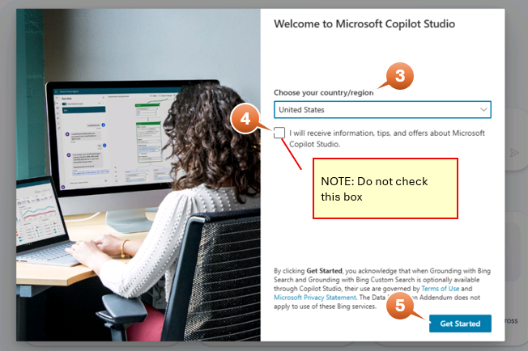

6. Skip the Welcome window
7. Click on three dots on the top right
8. Click **X Cancel agent creation**
9. Click **Yes, continue**

   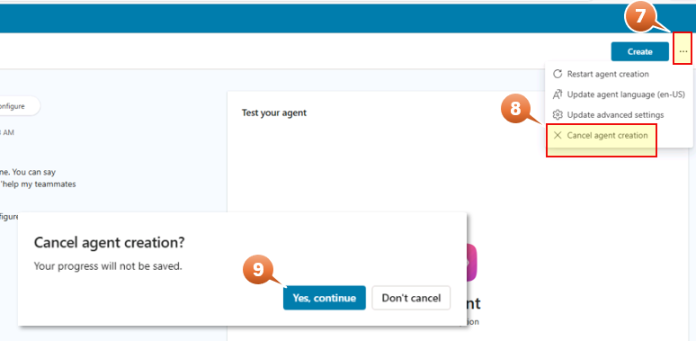

Now we start the process to import the Solution packages.
Let's start with the **IntakeAgent_1_0_0_7** package

10. On the left ribbon click on the three dots if don't see the **Solutions**
11.  Click on **Solutions** (New tab is open in the Edge browser)

      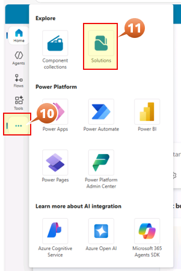

12.  Click **Import Solution** from the command bar
13.  Click **Browse** to select the solution package to import
14.  Select the zip file **IntakeAgent_1_0_0_7.zip** solution package
15. Click **Open**

       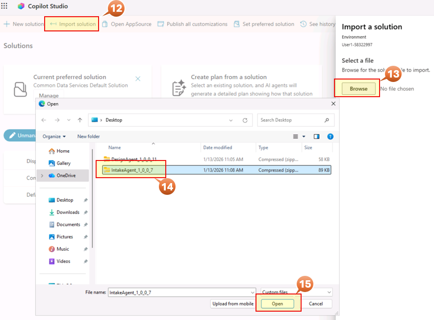

16. Click **Next**
17. Click **Next**
18. When green checks are in all services then click **Import**

     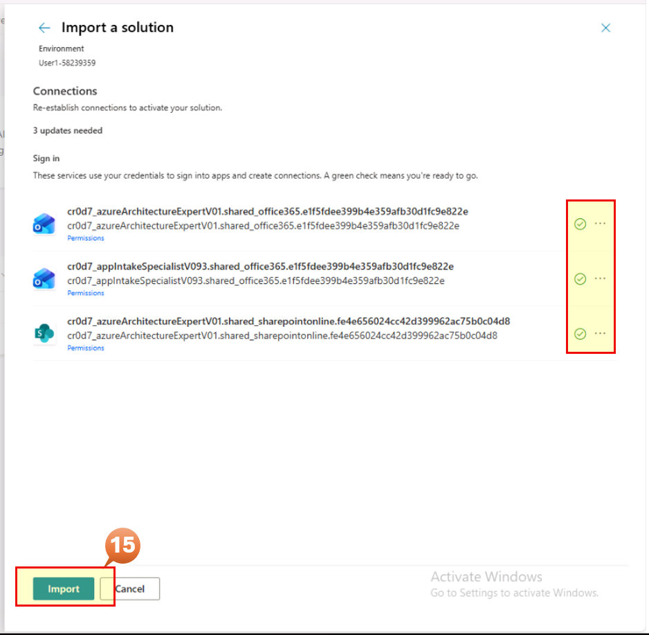

Let's continue importing the **DesignAgent_1_0_0_11** package
*Execute the prior steps 12 and 13 again* and come back to step 19

19. Select the zip file **DesignAgent_1_0_0_11.zip** solution package
20. Click **Open**

     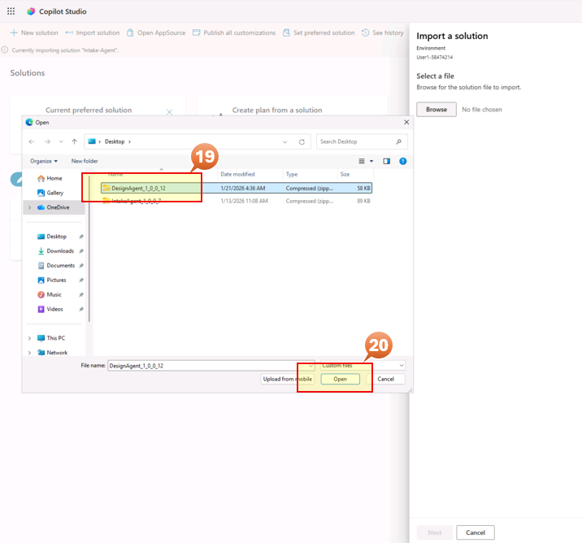

21. Click **Next**
22. Click **Next**
23. When green checks are in all services then click **Import**

     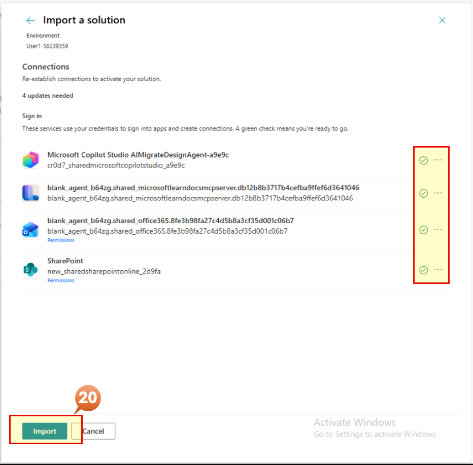

Wait for the packages to be imported. Once imported you will see the status change to **Solution "Intake-Agent" imported successfully with warnings**. Same for the Application-Design-Agent package. It's Ok

 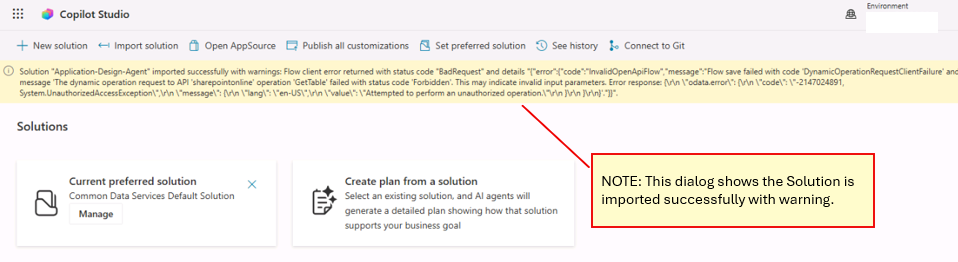

## Step 2: Update Imported Agents

In this step we are going to update some configuration in the Agents included in the imported packages.
Let's start with the **Intake-Agent**

### Step 2.1: Update Intake Agent Tools

1. In the Solution window from the prior Step 1.1, click on **Intake-Agent**

   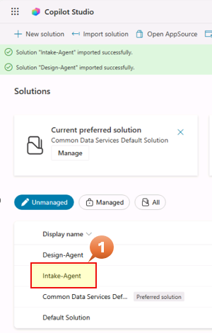

2. On the left menu, click **Agents (2)**
3. Validate there are 2 agents (App Intake Agent v1.3.4 and Azure Architecture Expert v0.6.1) and Click on **App Intake Agent v1.3.4**

   

4. Click on **Tools** on the top ribbon
5. Click on **Send an Email (V2)** connector Name

   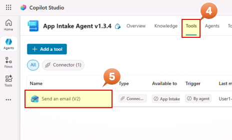

6. Click on **Inputs** on the left ribbon
7. Replace the **Value** field content in the Input **To** by your username provided for this Lab **Username: +++@lab.CloudPortalCredential(User1).Username+++**
8. **Save**

   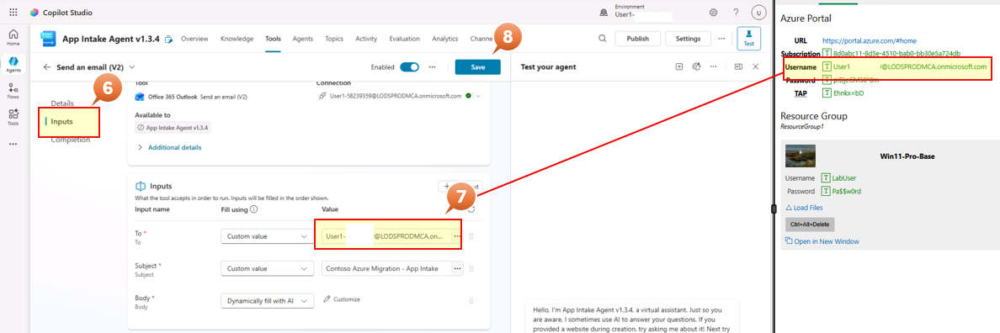

Let's continue with the Application Design Agent. Don't need to close this window

### Step 2.2: Configure Design Agent Settings

1. Hover over the Agent icon on the left ribbon to show the list of the Agents and click on **Application Design Agent**
2. Verify the agent overview displays correctly in the Test Agent window:
**Expected Overview Screen:**

   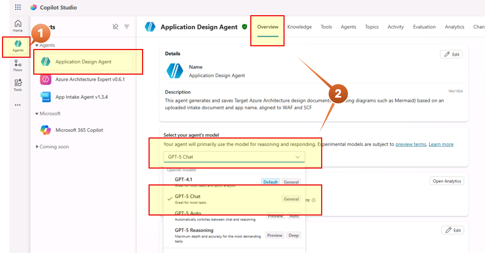

3. In the Overview tab on the top, scroll down to Knowledge and verify **Web Search** is Disable

   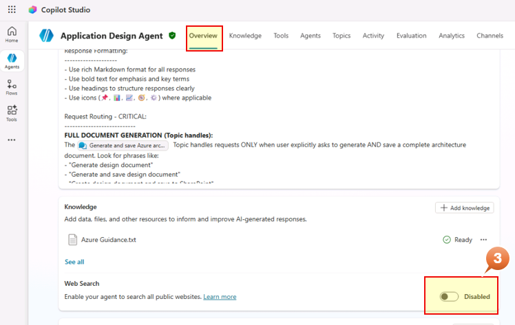

Congratulations! All Solutions are imported.
You can keep open the Edge browser and move to Module 2 - Connection configurataion