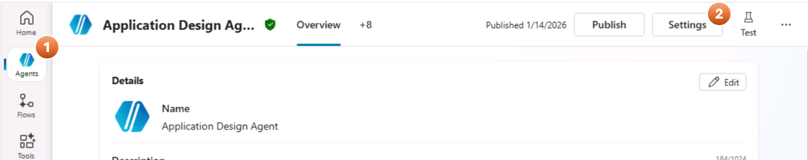

# Module 2: Connection Configuration (11 minutes)

After importing the solution, you must establish connections for the agent to function correctly.

## Step 2.1: Identify Required Connections

### Step 2.1.1 Intake Agent Connections

1. Select **Agents** in the left sidebar, select **App Intake Agent v1.3.4** from the list of agents, and click **Settings**
   

2. On the **Settings** Page, click on **Connection Settings** on the left menu, and click **Connect** for for the **Office 365 Outlook** connection in the list:
   

3. In the Dialog that opens up, once you see a green check in front of your username, click **Submit**:
   

### Step 2.1.2 Design Agent Connections

The Design Agent requires the following connections:

| Connection                   | Purpose                                                         |
| ---------------------------- | --------------------------------------------------------------- |
| **SharePoint**               | Store and retrieve intake documents and generated architectures |
| **Office 365 Outlook**       | Send generated documents via email                              |
| **Microsoft Learn Docs MCP** | Knowledge                                                       |

1. Under **Agents** in the left side bar, click **Application Design Agent** from the list of Agents, and click **Settings**
   

2. On the **Settings** Page, click on **Connection Settings** on the left menu, and follow the connection specific steps provided immediately after this step.
   

3. **Microsoft Learn Docs MCP Connection** (1 minute)

   1. Click **Connect** for the **Microsoft Learn Docs MCP** connection in the list.
   2. In the Dialog box that opens up, once you see a green check in front of your username, click **Submit**:
      

4. **Office 365 Outlook Connection** (1 minute):

   1. Click **Connect** for the **Office 365 Outlook** connection in the list.
   2. In the Dialog box that opens up, once you see a green check in front of your username, click **Submit**:
      

5. **Save Design Document Connection** (1 minute)

   1. Click **Connect** for the **Save Design Document** connection in the list.
   2. In the Dialog box that opens up, once you see a green check in front of your username, click **Submit**.

6. Verify all connections show **Connected** status, and then Close **Settings** window.

   | Connection               | Status       |
   | ------------------------ | ------------ |
   | Microsoft Learn Docs MCP | ✅ Connected |
   | Office 365 Outlook       | ✅ Connected |
   | Save Design Document     | ✅ Connected |

## Step 2.2: Review Flow Connections

1. Select **Flows** in the left sidebar in Copilot Studio. In the page the opens up, you should see following statuses:

   | Name                         | Status    |
   | ---------------------------- | --------- |
   | Save Design Document         | Published |
   | ExtractDocumentText          | Published |
   | Invoke Design Agent          | Draft     |
   | Save Design to SharePoint v1 | Draft     |

   Refer to the detailed instructions for each flow in the following steps.

2. **Invoke Design Agent** flow

   1. Hover over the row for **Invoke Design Agent**, click the **elipses (...)** to open a context menu and select **Edit agent flow** option:
      
   2. On the flow Designer page, click on **When a file is created or modified (properties only)** action to exapand it.

      1. In the action card, clear the content in _Site Address_ input by clicking the **X** near the right side of the input box.

      2. Click on the display button (**˅**), and select the SharePoint site address from the list, the you had created in the last module.

         

      3. For the _Library Name_ input, clear the content by clicking the **X** near the right side of the input box. Click on the display button (**˅**), and select **Documents** folder.

      4. Click on the title of the action (**When a file is created or modified (properties only)**) to collapse it.

   3. On the flow Designer page, click on the **Get file content** action to expand it.

      1. In the action card, follow the same procedure as the first sub-step in the previous step, and updat ethe _Site Address_ to the SharePoint site you had created in the last module.
         

   4. Once is done click on **Publish** button on the top right corner of the Designer page.

3. **Save Design to SharePoint v1** flow

   1. Select **Flows** in the left sidebar in Copilot Studio. In the page that opens up, hover over the row for **Save Design to SharePoint v1**, click the **elipses (...)** to open a context menu and select **Edit agent flow** option:
      

   2. On the flow Designer page, click on **Create file** action to exapand it.

      1. In the action card, clear the contents in _Site Address_ input by clicking the **X** near the right side of the input box.

      2. Then, click on the display button (**˅**), and select the SharePoint site you had crated.

      3. Next, delete content in _Folder Path_ input box, click on folder icon (near the right side of the input box) and select Generated Architectures folder.

   3. On the flow Designer page, click on the action **Get file properties** to expand it.
      1. Delete content in _Site Address_ and click on display button, select the SharePoint site you had crated.
      2. Delete content in _Library Name_, click on display button and select _Document_.
   4. Once is done click on **Publish**

4. Review all flows status = **Published**
