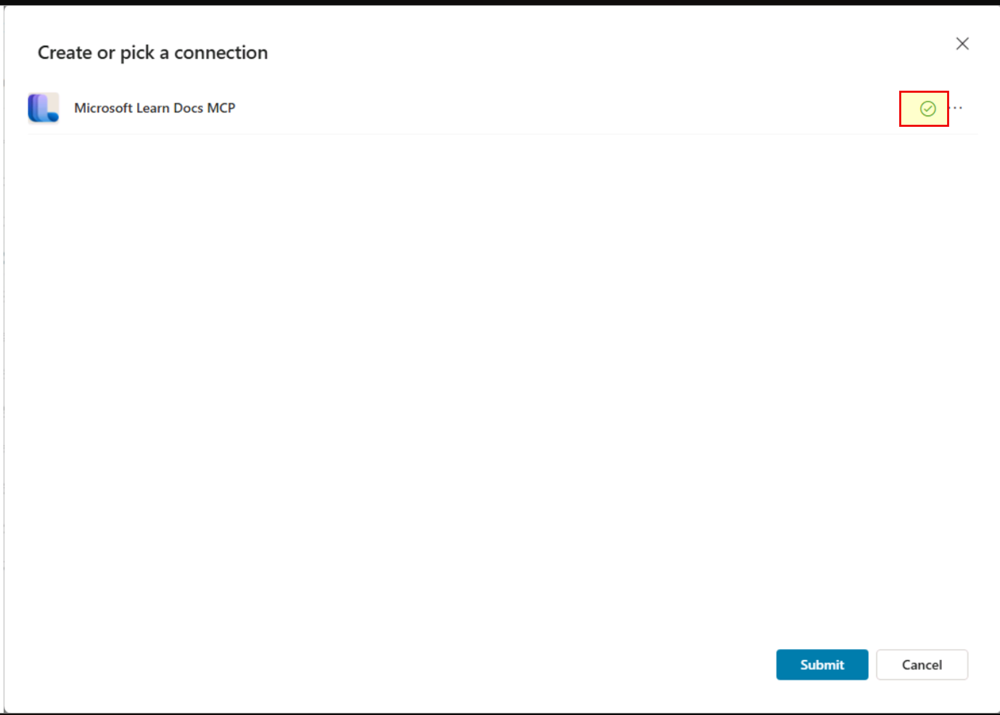
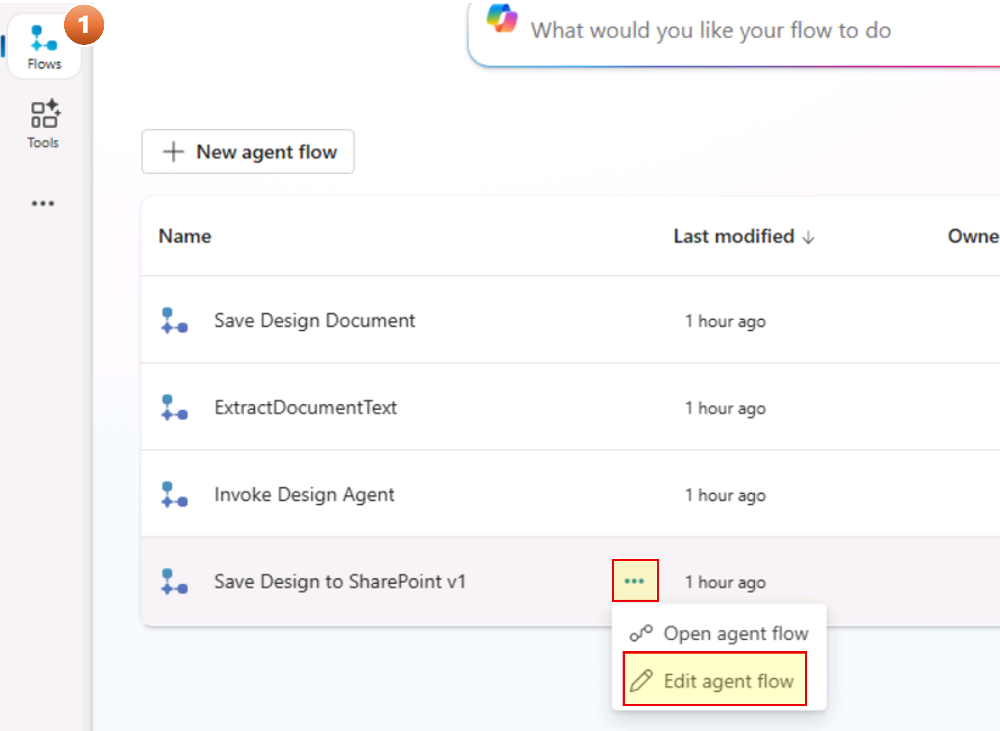

# Module 2: Connection Configuration (10 minutes)

After importing the solution, you must establish connections for the agent to function correctly.

## Step 2.1: Identify Required Connections

### Step 2.1.1 Intake Agent Connections

1. Switch to your Copilot Studio browser tab (or open a new browser tab and navigate to +++https://copilotstudio.microsoft.com+++), select **Agents** in the left sidebar, select **App Intake Agent v1.3.4** from the list of agents, and select **Settings**
   

2. On the **Settings** page, select **Connection Settings** on the left menu, and select **Connect** for the **Office 365 Outlook** connection in the list:
   

3. In the dialog that opens up, once you see a green check in front of your username, select **Submit**:
   

### Step 2.1.2 Design Agent Connections

The Design Agent requires the following connections:

| Connection                   | Purpose                                                         |
| ---------------------------- | --------------------------------------------------------------- |
| **Save Design Document**     | Store and retrieve intake documents and generated architectures |
| **Microsoft Learn Docs MCP** | Knowledge                                                       |

1. Under **Agents** in the left sidebar, select **Application Design Agent** from the list of agents, and select **Settings**
   

2. On the **Settings** page, select **Connection Settings** on the left menu, and follow the connection-specific steps provided immediately after this step.
   

3. **Microsoft Learn Docs MCP Connection** (1 minute)
   1. Select **Connect** for the **Microsoft Learn Docs MCP** connection in the list.
   2. In the dialog box that opens up, once you see a green check in front of your username, select **Submit**:
      

4. **Save Design Document Connection** (1 minute)
   1. Select **Connect** for the **Save Design Document** connection in the list.
   2. In the dialog box that opens up, once you see a green check in front of your username, select **Submit**.
      

5. Verify all connections show **Connected** status, and then close the **Settings** window.

   | Connection               | Status       |
   | ------------------------ | ------------ |
   | Microsoft Learn Docs MCP | ✅ Connected |
   | Save Design Document     | ✅ Connected |

## Step 2.2: Review Flow Connections

1. Select **Flows** in the left sidebar in Copilot Studio. On the page that opens up, you should see the following statuses:

   | Name                         | Status    |
   | ---------------------------- | --------- |
   | Save Design Document         | Published |
   | ExtractDocumentText          | Published |
   | Invoke Design Agent          | Draft     |
   | Save Design to SharePoint v1 | Draft     |

   Refer to the detailed instructions for each flow in the following steps.

2. **Invoke Design Agent** flow
   1. Hover over the row for **Invoke Design Agent**, select the **ellipsis (...)** to open a context menu, and select **Edit agent flow** option:
      
   2. On the flow Designer page, select the **When a file is created or modified (properties only)** action to expand it.
      1. In the action card, clear the content in the _Site Address_ input by selecting the **X** near the right side of the input box.

      2. Select the display button (**˅**), and select the SharePoint site address from the list that you had created.

         

      3. For the _Library Name_ input, clear the content by selecting the **X** near the right side of the input box. Select the display button (**˅**), and select the **Documents** folder.

      4. Select the title of the action (**When a file is created or modified (properties only)**) to collapse it.

   3. On the flow Designer page, select the **Get file content** action to expand it.
      1. In the action card, follow the same procedure as the previous step, and update the _Site Address_ to the SharePoint site you had created.
         

   4. Once complete, select the **Publish** button on the top right corner of the Designer page.

3. **Save Design to SharePoint v1** flow
   1. Select **Flows** in the left sidebar in Copilot Studio. On the page that opens up, hover over the row for **Save Design to SharePoint v1**, select the **ellipsis (...)** to open a context menu, and select **Edit agent flow** option:
      

   2. On the flow Designer page, select the **Create file** action to expand it.
      1. In the action card, clear the contents in the _Site Address_ input by selecting the **X** near the right side of the input box.

      2. Then, select the display button (**˅**), and select the SharePoint site you had created.

      3. Next, delete content in the _Folder Path_ input box, select the folder icon (near the right side of the input box), and select the _Shared Documents > Architecture-Documents_ folder.

   3. On the flow Designer page, select the action **Get file properties** to expand it.
      1. Delete content in _Site Address_ and select the display button, then select the SharePoint site you had created.
      2. Delete content in _Library Name_, select the display button, and select _Documents_.
   4. Once complete, select **Publish**.

4. Review all flows status = **Published**; you may have to refresh your page.
