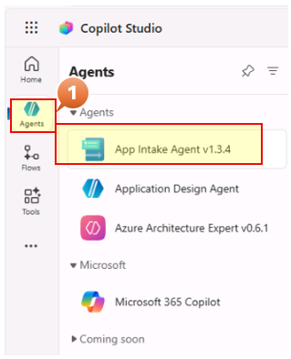
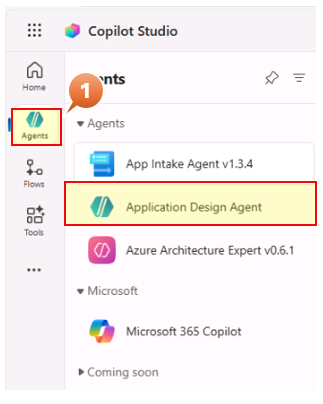
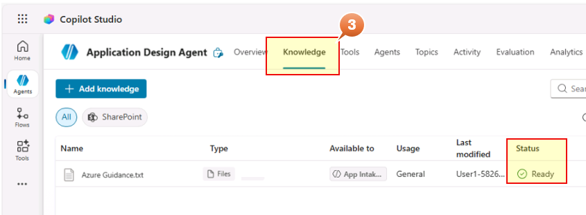

# Module 3: Knowledge Base Setup (1 minute)

The App Intake Agent and Application Design Agent use a knowledge file to ensure output structure matches deployment requirements.

## Step 1: App Intake Agent v1.3.4 Knowledge

1. In the current Edge browser tab, in Copilot Studio, Hover over the Agent icon on the left ribbon to show the list of the Agents and click on **App Intake Agent v1.3.4**

    

2. Click the **Knowledge** tab in the top navigation and review the Status = **Ready**

    

    > ℹ️ The knowledge is **not mandatory**. If absent, the agent proceeds using the data points and instructions.

## Step 2: Application Design Agent

1. Hover over the Agent icon on the left ribbon to show the list of the Agents and click on **Application Design Agent** from the list of Agents

    

2. Click the **Knowledge** tab in the top navigation and review the Status = **Ready**

    

    > 📄 **Knowledge File Purpose:** This text-based file guides the agent to produce resource configuration tables in a format compatible with the deployment agent.

Congratulations, you've completed all steps of this module.
You can move to Module 4-Design Agent usage