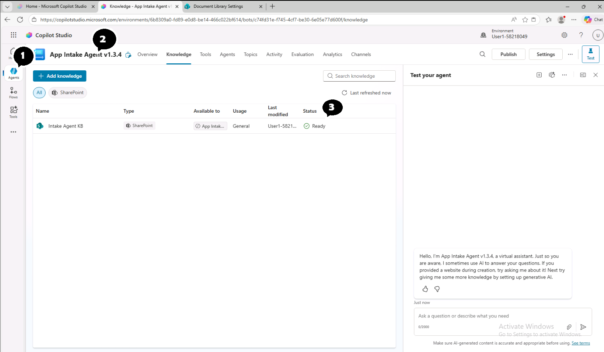
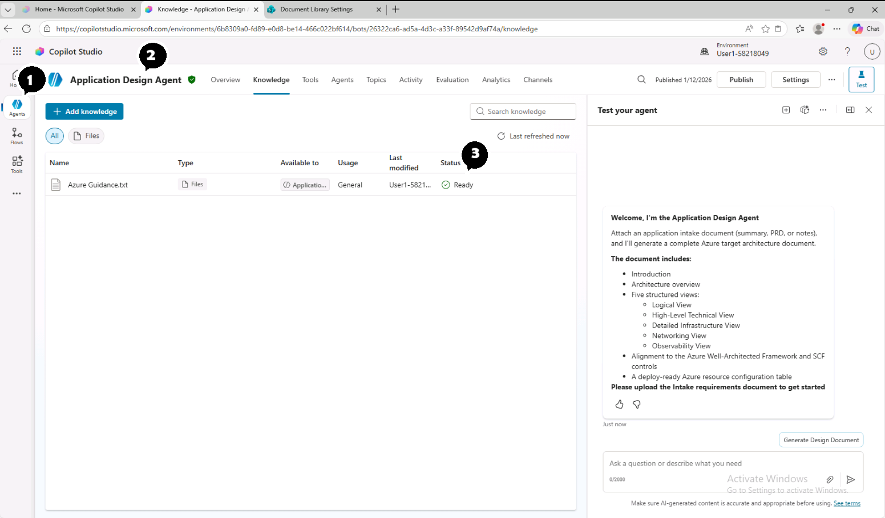

# Module 3: Knowledge Base Setup (1 minute)

The Intake Agent and Design Agent use a knowledge file to ensure output structure matches deployment requirements.

## Step 3.1: Navigate to Knowledge (30 seconds)

1. In Copilot Studio, open the **App Intake AGent v1.3.4** from the list of Agents
2. Click the **Knowledge** tab in the top navigation



> ℹ️ The knowledge is **not mandatory**. If absent, the agent proceeds using the data points and instructions.

3. Open the **Application Design Agent** from the list of Agents
4. Click the **Knowledge** tab in the top navigation



> 📄 **Knowledge File Purpose:** This text-based file guides the agent to produce resource configuration tables in a format compatible with the deployment agent.

## Step 3.3: Add Additional Knowledge (Optional)

To add custom knowledge sources:

1. Click **+ Add knowledge**
2. Select source type:
   - **Files** – Upload PDF, Word, or text documents
   - **SharePoint** – Connect to document libraries
   - **Public website** – Enable web search (if required)

3. Upload your file and wait for processing to complete
4. Verify status shows **Ready**

## Step 3.4: Configure Web Search (Optional)

Web Search allows the agent to reference public documentation:

```
Web Search: Disabled (Recommended for secure environments)
```

> ⚠️ **Security Note:** Keep Web Search disabled for engagements involving sensitive customer data.
