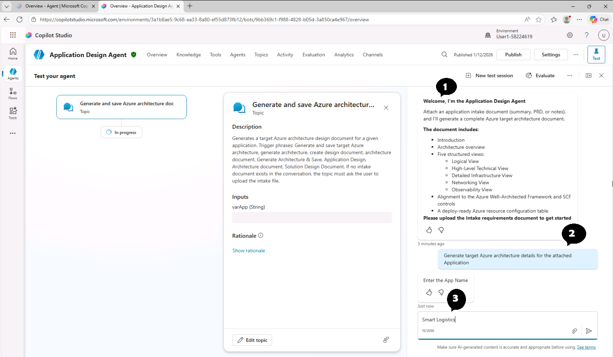
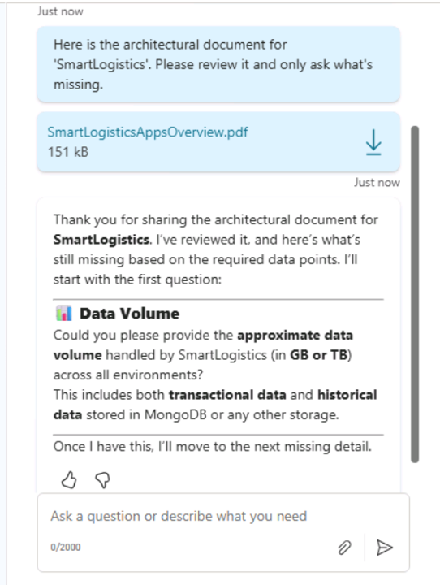
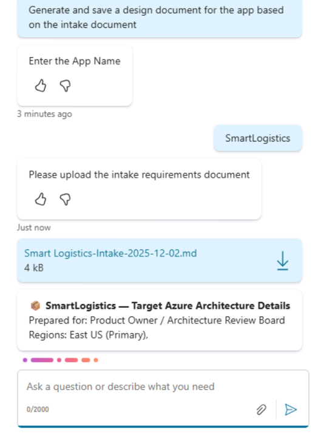

# Module 4: Testing the Agents (25 minutes)

## 4.1 Intake Agent

1. Select **Agents** in the left sidebar, and select **App Intake Agent v1.3.4** from the list of agents
   

2. Click inside the chat input box in the **Test your agent** panel on the right side of the Agent Overview page.
   

3. Attach the **SmartlogisticAppsOverview.pdf** file from the Desktop, then either click the text below (to insert it to the input box), or type it yourself, and click the send button (next to attach button):

   `Here is the architectural document for 'SmartLogistics'. Please review it and only ask what's missing.`

   

   You should see a response similar to this in your chat window:
   

   Go ahead, and start responding to the questions asked by the Agent (~7-8), and once the Agent has all the information, it would respond with the _SmartLogistics Assessment Summary_ table.

Congratulations! The basic testing of the Intake agent is complete. Here are a few additional prompts for you to try:

`Begin intake. I have an architecture document to upload`

`Create a migration intake report for 'CRM Gateway' and email it to the migration team when done`

## 4.2 Design Agent (Interactive Mode)

The Design Agent supports two operational modes:

- **Interactive Mode**
- **Autonomous Mode**

This module focuses on the **interactive** conversation-based approach, and automomous mode will be covered in the next module.

1. Select **Agents** in the left sidebar, and select the **Application Design Agent** from the list of Agents
   

2. Click inside the chat input box in the **Test your agent** panel on the right side of the Agent overview page.
3. Review the agent's welcome message:
   

4. In the test panel, select the _Generate a Design Document_ suggested prompt button. Additionaly, You can either click the text below to insert it into the input box, or type it yourself.:

   `Generate design document for the target Azure architecture of the attached Application`

5. Enter the application name when prompted:

   `SmartLogistics`

6. Attach the **Intake.md** file from the Desktop.

   You should see the agent start responding:

   

7. Wait for the agent to process (Average duration: ~71 seconds)

8. Don't move away from the window until the response is completed.

9. The The agent will generate a comprehensive architecture document with the following structure:

   ```
   📦 [AppName] — Target Azure Architecture Details

   ├── 📋 Introduction
   ├── 🔄 Data Flows
   ├── 🏗️ Architecture Overview
   ├── 📐 Detailed Description of Each View
   │   ├── 1) Logical View — Conceptual
   │   ├── 2) High-Level Technical View
   │   ├── 3) Detailed Infrastructure View
   │   ├── 4) Networking View
   │   └── 5) Observability View
   ├── 📝 Rationales
   ├── ⚠️ Limitations
   └── 📊 Azure Resource Table
   ```
