# Module 5: Autonomous Agent Mode

The Design Agent can operate as a fully autonomous agent, automatically processing intake documents without user intervention. This mode is ideal for high-volume environments or when architects want to batch-process multiple application assessments.
In this Lab we'll upload a file into the SharePoint folder *Intake-Documents* and the Agent will create and save the Architecture Design Document into the SharePoint folder *Architecture-Documents*

**Understanding Autonomous Mode**

In Autonomous Mode, the agent workflow is:

```
┌─────────────────────────────────────────────────────────────────┐
│                    AUTONOMOUS WORKFLOW                          │
├─────────────────────────────────────────────────────────────────┤
│                                                                 │
│  ┌──────────────────┐                                           │
│  │📁SharePoint      |Intake document uploaded to designated    |  
│  │  Intake-Documents│   folder                                  |
|  |    Folder        │                                           |
│  └────────┬─────────┘                                           │
│           │                                                     │
│           ▼ (Trigger)                                           │
│  ┌──────────────────┐                                           │
│  │ 🤖 Design Agent  │ ← Automatically activated                │
│  │    Triggered     │                                           │
│  └────────┬─────────┘                                           │
│           │                                                     │
│           ▼                                                     │
│  ┌──────────────────┐                                           │
│  │ 📄 Extract       │ ← App name extracted from filename       │
│  │    Document Data │   or document metadata                    │
│  └────────┬─────────┘                                           │
│           │                                                     │
│           ▼                                                     │
│  ┌──────────────────┐                                           │
│  │ 🏗️ Generate      │ ← Full architecture document             │
│  │    Architecture  │   created automatically                   │
│  └────────┬─────────┘                                           │
│           │                                                     │
│           ▼                                                     │
│  ┌──────────────────┐                                           │
│  │ 💾 Save to       │ ← Output stored in designated            │
│  │    SharePoint    │   output folder                           │
│  └────────┬─────────┘                                           │
│           │                                                     │
│           ▼                                                     │
│  ┌──────────────────┐                                           │
│  │      End         │                                           │
│  │                  │                                           │
│  └──────────────────┘                                           │
└─────────────────────────────────────────────────────────────────┘
```

## Step 1: Triggers Configuration

1. In Copilot Studio,Hover over the Agent icon on the left ribbon to show the list of the Agents and click on **Application Design Agent**

    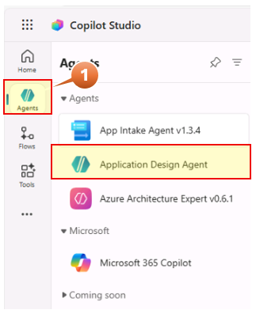

2. In the agent overview, navigate to the **Triggers** section
3. Click **+ Add trigger**

    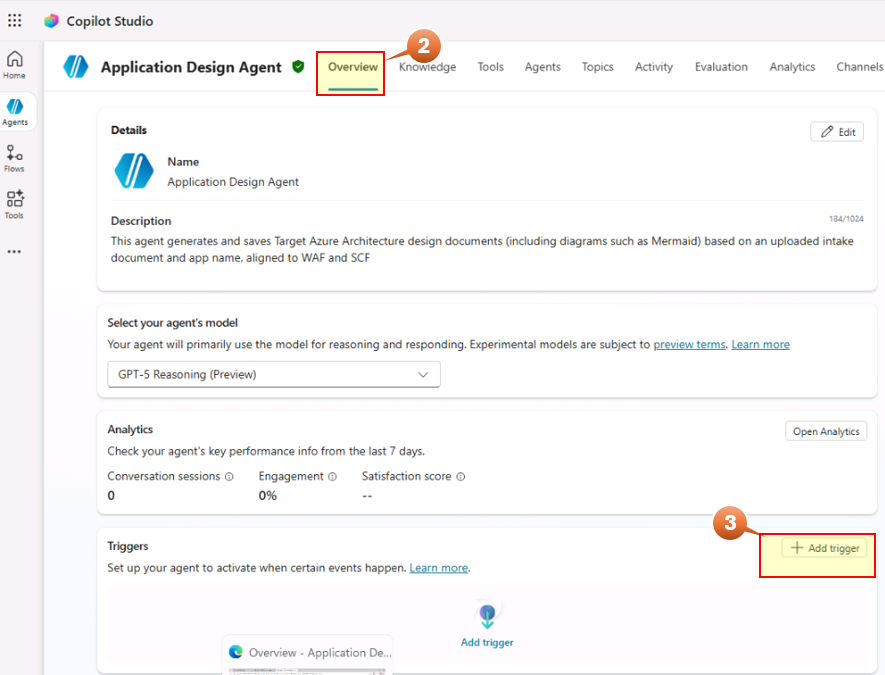

4. Select **When an file is created (properties only)** from the list of triggers and click **Next**

    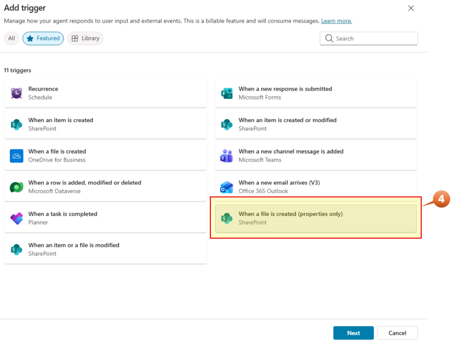

5. Review the green checks in the apps and Click **Next**

    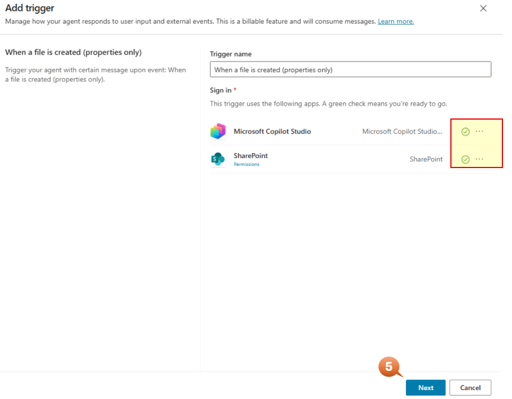

6. Configure the trigger settings:

    Trigger Configuration

    | Type | Value |
    | ---- | ----- |
    | (1) Trigger Type | When a file is created in SharePoint (Properties only) |
    | (2) Site Address | Select from the list (This is the Site configured in Module 2) |
    | (3) Library Name | Select **Documents** from the list |
    | (4) Folder Path  | Select **/Shared Document//Intake-Documents** from the list |
    | (5) Limit Columns by View (Optional)| in blank|
    | (6) Additional instructions to the agent when it's invoced by this trigger | **Use contect from Body** (Don't change it)

    ──────────────────────────────────────────────────────────────────────────────────────

    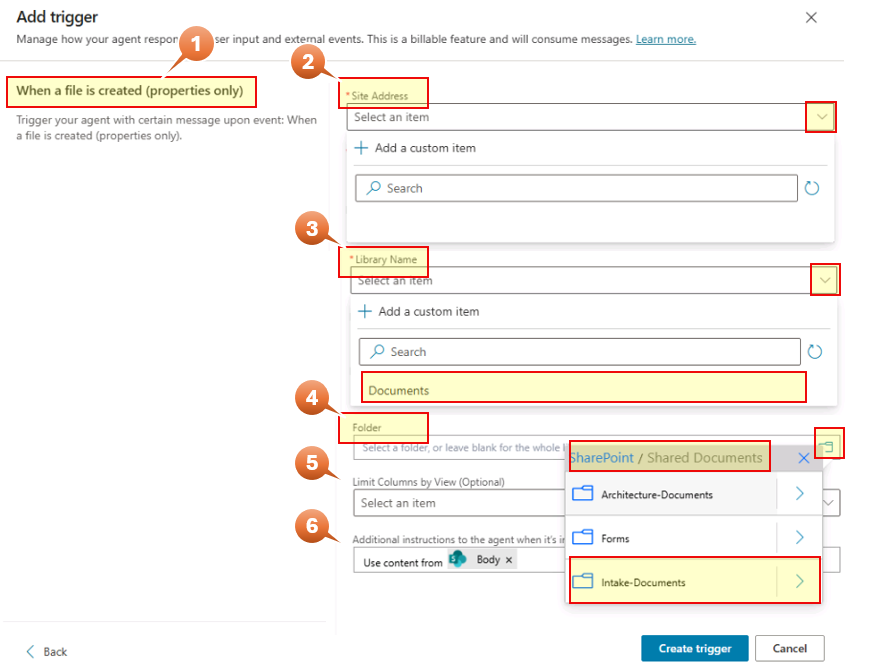

7. Click **Create trigger**
8. **Close**

The Trigger is set, let's test the Autonomous mode

## Step 2: Testing Autonomous Mode

We are ready to upload a document into SharePoint to make our Agent generates a Design document to migrate to Azure the application detailed in the document

1. To navigate to Sharepoint, click on the waffle icon on the top left of your current Edge browser tab and select SharePoint

    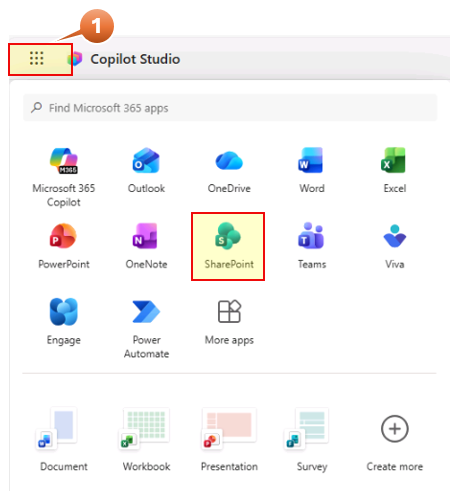

2. click on the site name under **Following** (or under **Recent**) in the left menu

    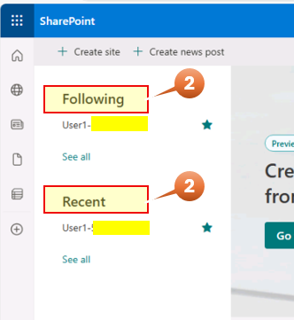

    This was created in step Module 0 Prerequisites

3. Click on Document on the left menu
4. Click on **Intake-Documents** folder

    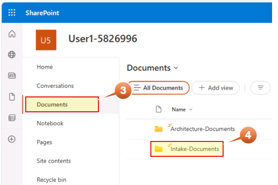

5. Upload the document. Click on **Create or upload** on the right
6. Click on **Files upload**
7. Select the **Smart Logistics-Intake-2025-12-02** file frome the Desktop and click  **Open**

    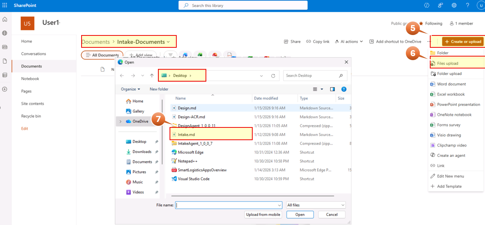

    This is the trigger to generate the Design document. Before seen the Architecture Design Document let's check the flows are completed successfully.

    Let's check the Flow to Invoke the Agent

8. Go to the Edge tab where Copilot Studio is open. Hover over the **Flows** icon click on **Invoke Design Agent**.

    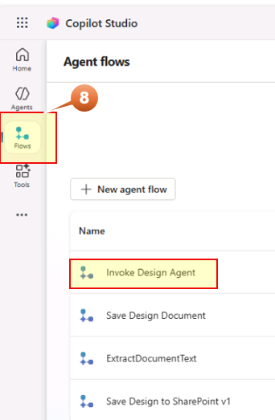

9. Navigate to the Overview tab on the top, go to **28-day run history**
10. The status will be *Succeeded**. If it is **Running** then click on **Refresh**

    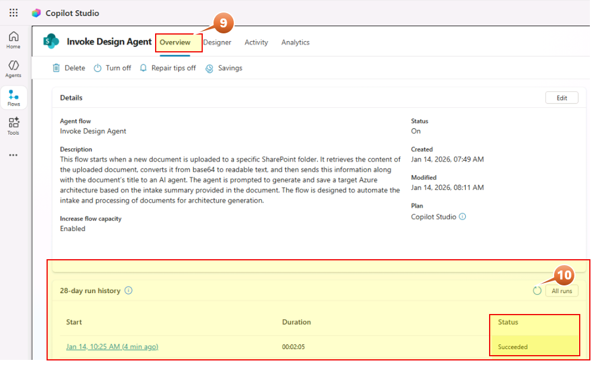

    Let's check the Flow to generate the Design document and save it into the Architecture-Documents has finished successfully

11. Go to Copilot Studio and click on **Flows** and click on **Save Design Document**.

    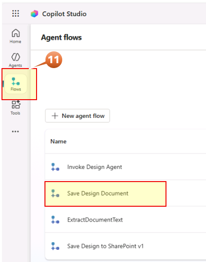

12. Navigate to the Overview tab on the top, go to **28-day run history**
13. The status will be *Succeeded**. If it is **Running** then click on **Refresh**

    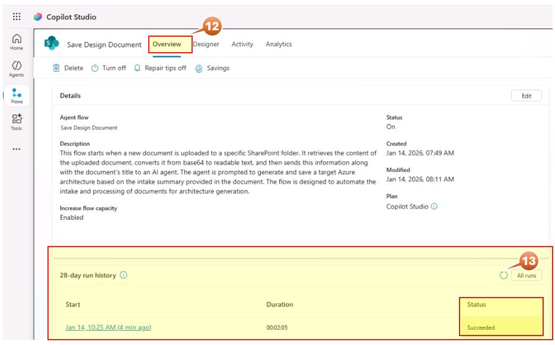

    Now let's check the document has been generated and saved in the Architecture-Documents folder in SharePoint

14. Go back to SharePoint and open the **Architecture-Documents** folder. Here you'll find the Architecture Design Document file **Smart Logistics-Target-Azure** generated and allocated in this path by the Agent

    