# Module 7:  Design Agent adding Cost Estimation Topic (10 minutes)

## Option 1: Add Cost Estimation Section

### Step 1: Enable Web Search and Topic changes Copilot Studio

1. Hover over the Agent icon on the left ribbon to show the list of the Agents and click on **Application Design Agent**

    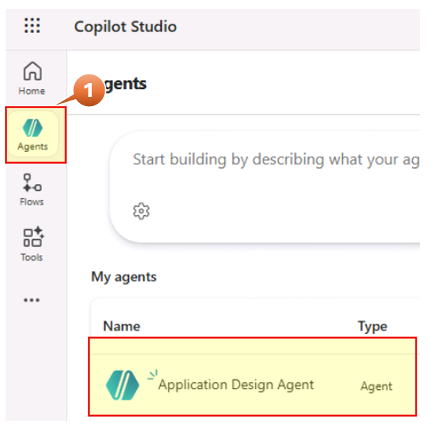

2. Navigate to Overview tab on the top
3. Scroll down to Knowledge and Enable **Web Search**

    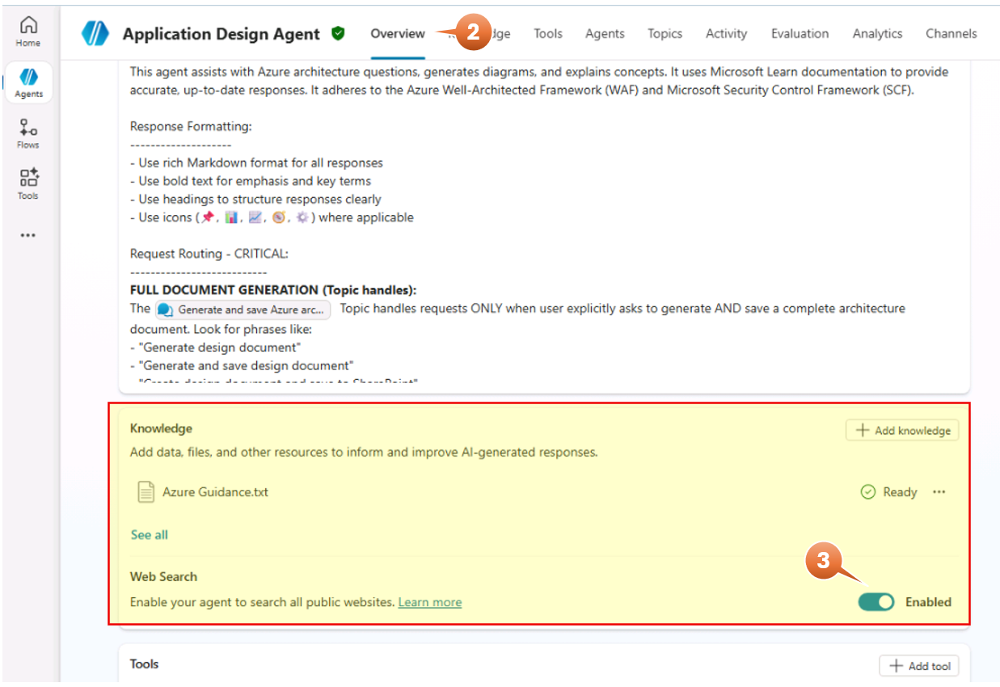

4. Go to Topics on the top and click **Generate and save Azure architecture doc** from the list of Topics.

    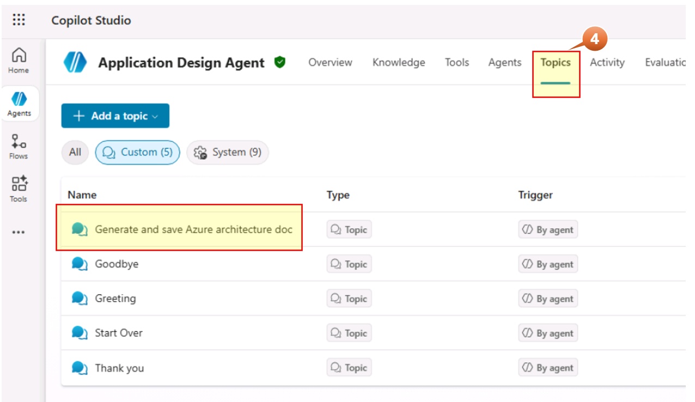

5. Scroll down to **GenerateAzureResourcesTable** Node and click **Add node** right after. 
6. Select Advanced -> Generative Answers

    

7. Click on the name and replace by **GenerateCostEstimation**
8. Click on the **elipses (...)** in the **Input** section
9. Add the following expression by clicking on the Formula tab 

        Topic.varApp & " " & Topic.varAzureResourceTable.Text.MarkdownContent

   and click on **Insert**

    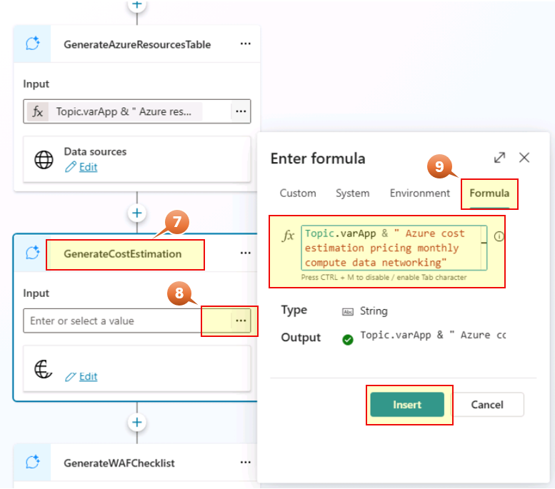

10. Stay in the Node, click on **elipses (...)** then **Properties**
11. In the Properties Pane scroll down to **Content moderation level**, under **Customize**  insert the generative AI instruction. *(Copy/Paste the text below)* 

    ```yaml
            You are an Azure cost estimation expert generating a cost analysis section.

            APPLICATION NAME: {Topic.varApp}

            AZURE RESOURCES IDENTIFIED:
            {Topic.varAzureResourceTable.Text.MarkdownContent}

            Generate ONLY the Cost Estimation section.

            COST ESTIMATION SECTION:
            Use exact heading: ## 💰 Estimated Monthly Costs

            INSTRUCTIONS:
            1. Analyze each Azure resource from the resource table
            2. Provide estimated monthly cost ranges based on the SKU tiers identified
            3. Group costs by category

            CREATE A COST TABLE:
            | Category | Resource | SKU | Est. Monthly Cost (USD) |
            |----------|----------|-----|-------------------------|

            Include these categories:
            - **Compute:** App Services, Functions, Container Apps
            - **Data:** SQL Database, Cosmos DB, Storage Accounts
            - **Networking:** Front Door, Firewall, Private Link, Bandwidth
            - **Security:** Key Vault, WAF, DDoS Protection
            - **Monitoring:** Application Insights, Log Analytics, Sentinel

            AFTER THE TABLE ADD:

            ### 📊 Cost Summary
            - **Estimated Monthly Total:** $X,XXX - $X,XXX
            - **Estimated Annual Total:** $XX,XXX - $XX,XXX

            ### 💡 Cost Optimization Recommendations
            Add 3-4 bullet points with cost-saving recommendations such as:
            - Reserved Instances for predictable workloads
            - Auto-scaling policies to reduce off-peak costs
            - Lifecycle policies for storage
            - Right-sizing based on actual usage

            PRICING GUIDELINES (use these estimates):
            - App Service P2v2: $150-200/month per instance
            - App Service P3v2: $300-400/month per instance
            - SQL Database Business Critical: $400-800/month
            - SQL Database Standard: $150-300/month
            - Event Hubs Standard: $20-50/month per TU
            - Event Hubs Premium: $100-200/month per PU
            - Key Vault Standard: $0.03 per 10,000 operations
            - Application Insights: $2.30 per GB ingested
            - Log Analytics: $2.76 per GB ingested
            - Azure Firewall Standard: $900-1,100/month
            - Azure Firewall Premium: $1,500-1,800/month
            - Front Door Standard: $35/month + $0.01/request
            - Front Door Premium: $330/month + usage
            - Azure Sentinel: $2.46 per GB analyzed
            - Storage Account (Hot): $0.018 per GB/month
            - Data Lake Storage: $0.02 per GB/month

            Add citation [1] at end.
      ```

     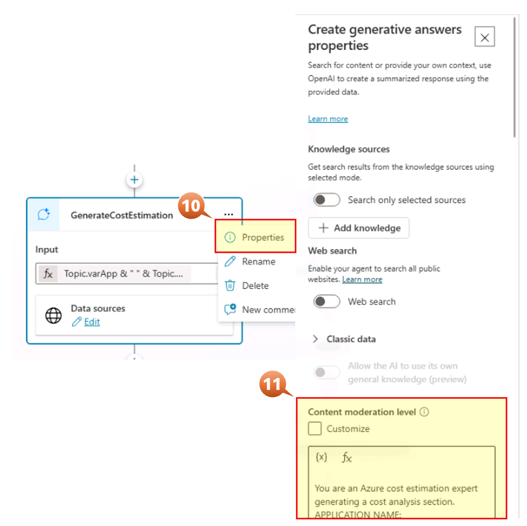

12. Stay in the **Properties Pane** scroll down and expand **Advanced**. We are going to create a variable to add the Cost estimation value
13. Select **Complete (recommended)** from the list in **Save LLM response** field
14. Click on the display button of the **Save bot response as**
15. Click on **{x} Create a new variable** to create a new Variable named **varCostEstimate**

    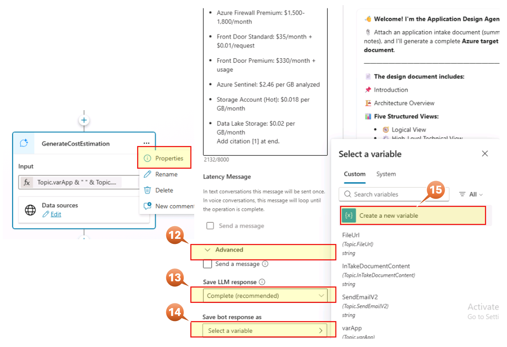


16. Close the Properties pane.

Now let's update two nodes (*Set variable value* and *Message*) in this flow with this new variable

- Set variable value

  1. In the Flow go to **Set variable value** Node (two nodes after the GenerateCostEstimation node recently created)
  2. Click on the **elipses (...)** in **To value** field into the **Set variable value** node
  
      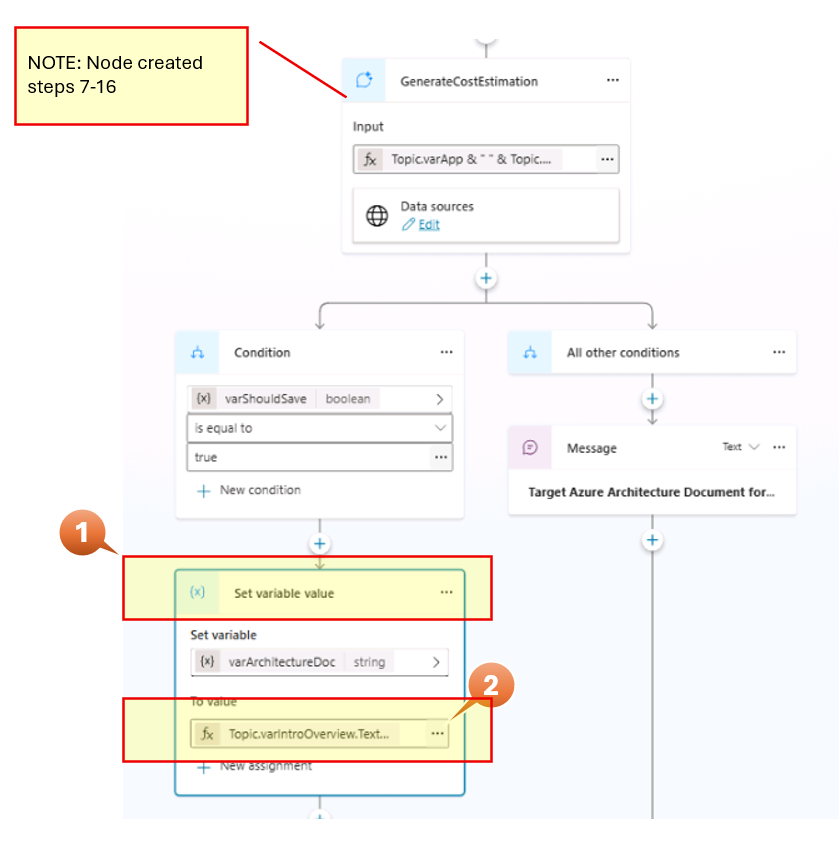
  
  3. Expand the form and enter at the end of the formula
      
        & Char(10) & Char(10)
        & Topic.varCostEstimate.Text.MarkdownContent
      
  4. Click **Insert**

      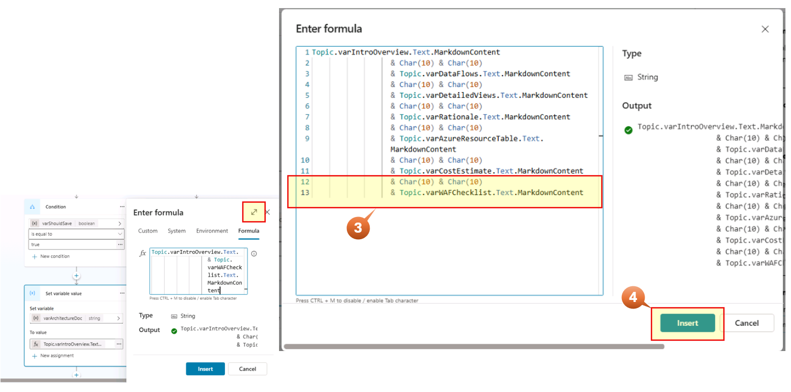

- Message

  1. In the Flow go to **Message** Node (on the right of the **Set variable value** Node of the prior step) and click on **Target Azure Architecture Document for**

      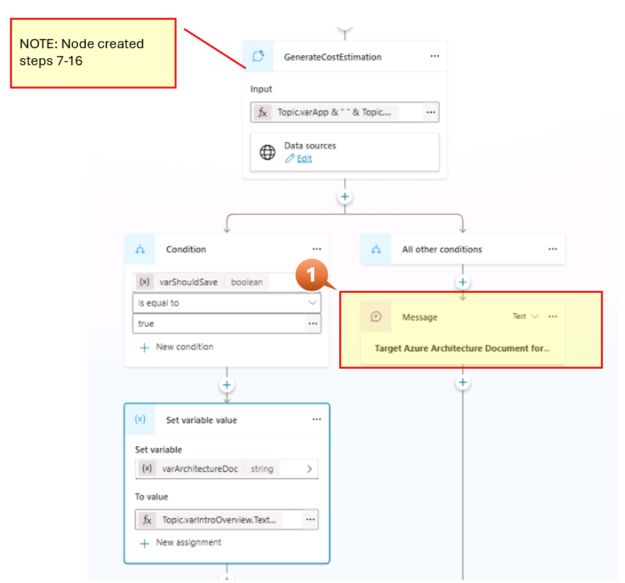

  2. Click on variable Icon
  3. in the text field type the name of the created variable **varcostestimate**
  4. scroll down and select **varCostEstimate.Text.MarkdownContent**

      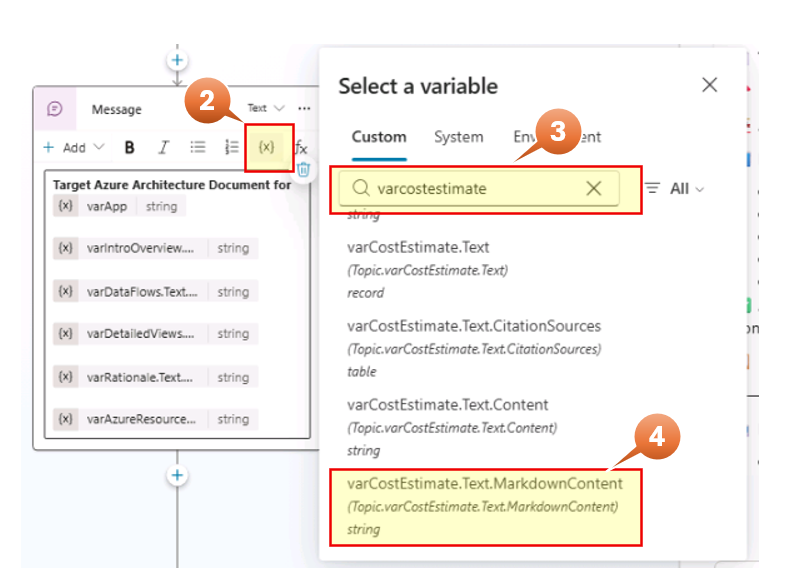

17. Start a New Test Session in the chat window to test the new feature as shown in the Image. 

      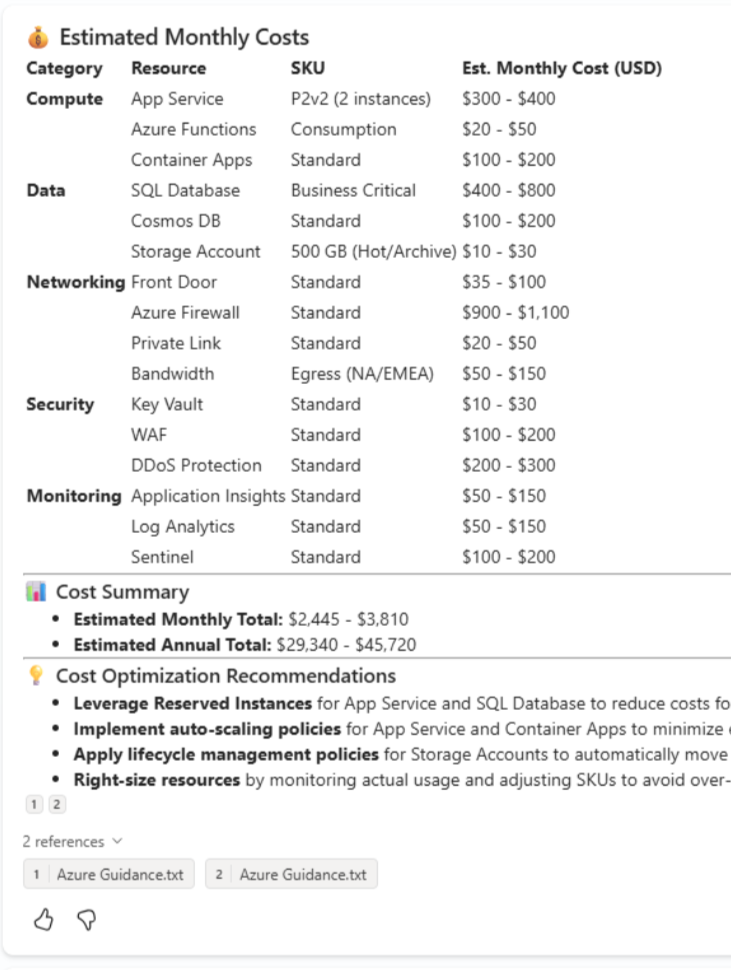

---

## Lab Option 2: Add WAF Compliance Checklist (Optional)

### Step 1: Open the Topic in Copilot Studio

1. Hover over the Agent icon on the left ribbon to show the list of the Agents and click on **Application Design Agent**

    

2. Go to Topics on the top and click on **Generate and save Azure architecture doc** from the list of Topics.

    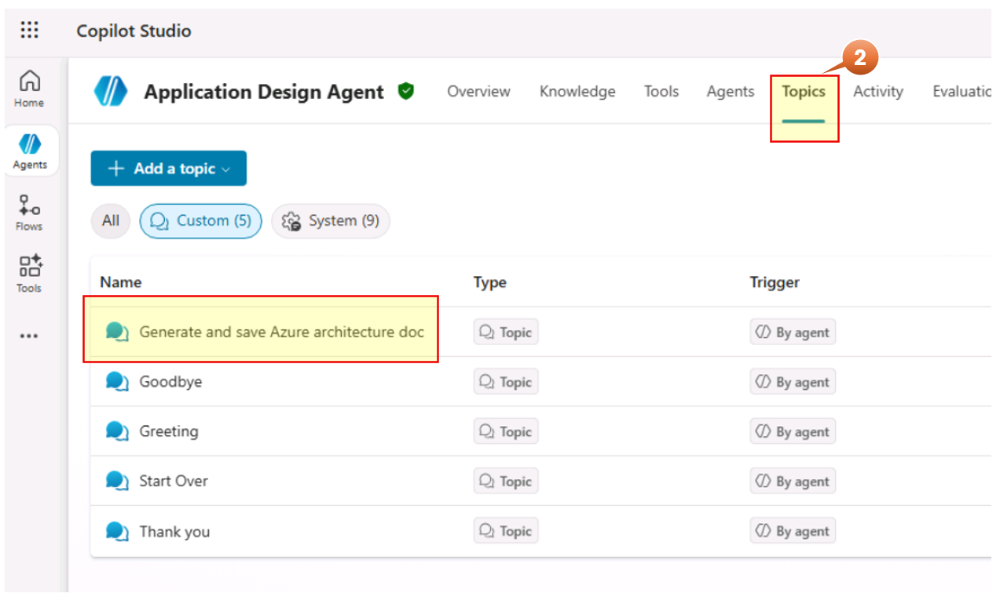

3. Click on the **elipses (...)** first.
4. Click on **"</> Open code editor"** to switch to YAML view. 

    

5. Find the `GenerateAzureResourcesTable` section with 'Ctrl+F' to add the WAF Checklist action.

    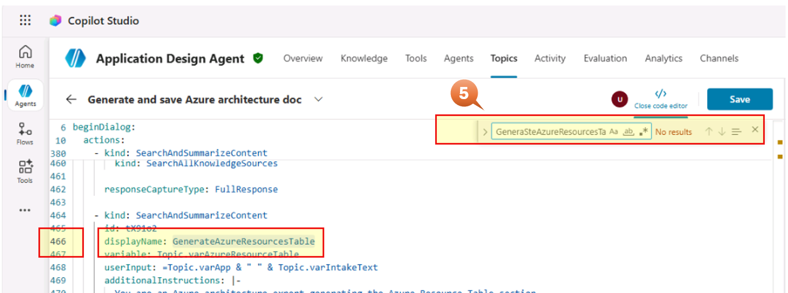

6. Scroll down where the **GenerateAzureResourcesTable** block ends. Add 2 lines after and insert the code below

 ```yaml
   - kind: SearchAndSummarizeContent
      id: CostEst01
      displayName: GenerateCostEstimation
      variable: Topic.varCostEstimate
      userInput: =Topic.varApp & " " & Topic.varAzureResourceTable.Text.MarkdownContent
      additionalInstructions: |-
        You are an Azure cost estimation expert generating a cost analysis section.

        APPLICATION NAME: {Topic.varApp}

        AZURE RESOURCES IDENTIFIED:
        {Topic.varAzureResourceTable.Text.MarkdownContent}

        Generate ONLY the Cost Estimation section.

        COST ESTIMATION SECTION:
        Use exact heading: ## 💰 Estimated Monthly Costs

        INSTRUCTIONS:
        1. Analyze each Azure resource from the resource table
        2. Provide estimated monthly cost ranges based on the SKU tiers identified
        3. Group costs by category

        CREATE A COST TABLE:
        | Category | Resource | SKU | Est. Monthly Cost (USD) |
        |----------|----------|-----|-------------------------|

        Include these categories:
        - **Compute:** App Services, Functions, Container Apps
        - **Data:** SQL Database, Cosmos DB, Storage Accounts
        - **Networking:** Front Door, Firewall, Private Link, Bandwidth
        - **Security:** Key Vault, WAF, DDoS Protection
        - **Monitoring:** Application Insights, Log Analytics, Sentinel

        AFTER THE TABLE ADD:

        ### 📊 Cost Summary
        - **Estimated Monthly Total:** $X,XXX - $X,XXX
        - **Estimated Annual Total:** $XX,XXX - $XX,XXX

        ### 💡 Cost Optimization Recommendations
        Add 3-4 bullet points with cost-saving recommendations such as:
        - Reserved Instances for predictable workloads
        - Auto-scaling policies to reduce off-peak costs
        - Lifecycle policies for storage
        - Right-sizing based on actual usage

        PRICING GUIDELINES (use these estimates):
        - App Service P2v2: $150-200/month per instance
        - App Service P3v2: $300-400/month per instance
        - SQL Database Business Critical: $400-800/month
        - SQL Database Standard: $150-300/month
        - Event Hubs Standard: $20-50/month per TU
        - Event Hubs Premium: $100-200/month per PU
        - Key Vault Standard: $0.03 per 10,000 operations
        - Application Insights: $2.30 per GB ingested
        - Log Analytics: $2.76 per GB ingested
        - Azure Firewall Standard: $900-1,100/month
        - Azure Firewall Premium: $1,500-1,800/month
        - Front Door Standard: $35/month + $0.01/request
        - Front Door Premium: $330/month + usage
        - Azure Sentinel: $2.46 per GB analyzed
        - Storage Account (Hot): $0.018 per GB/month
        - Data Lake Storage: $0.02 per GB/month

        Add citation [1] at end.
      fileSearchDataSource:
        searchFilesMode:
          kind: SearchAllFiles
      knowledgeSources:
        kind: SearchAllKnowledgeSources
      responseCaptureType: FullResponse
``` 

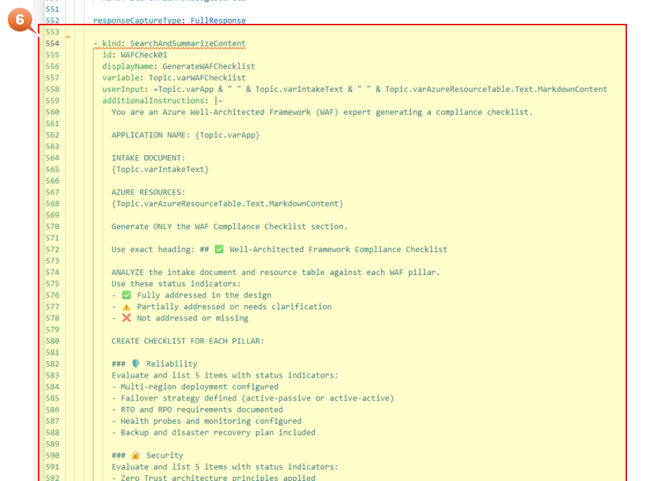

7. Find the `sendActivity_displayOnly` section with 'Ctrl+F' to add the WAF Checklist action.

    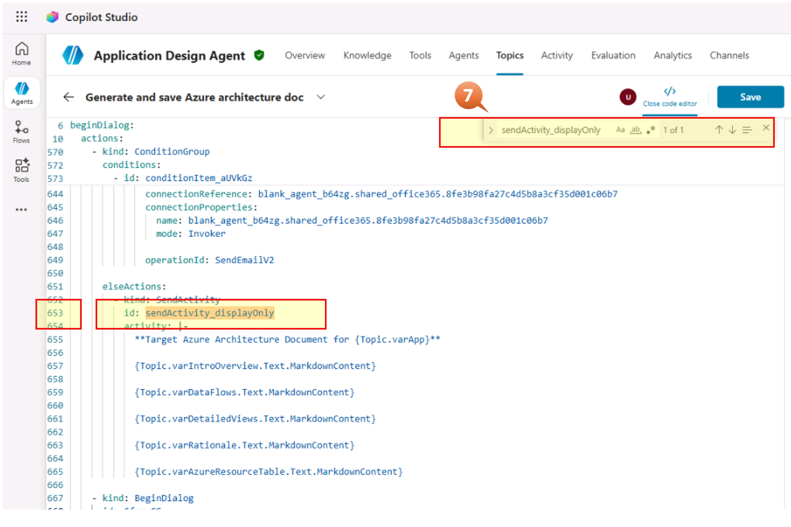

8. Scroll down where the **sendActivity_displayOnly** block ends . Add 2 lines after insert the code below

                    {Topic.varWAFChecklist.Text.MarkdownContent}

9. Save

    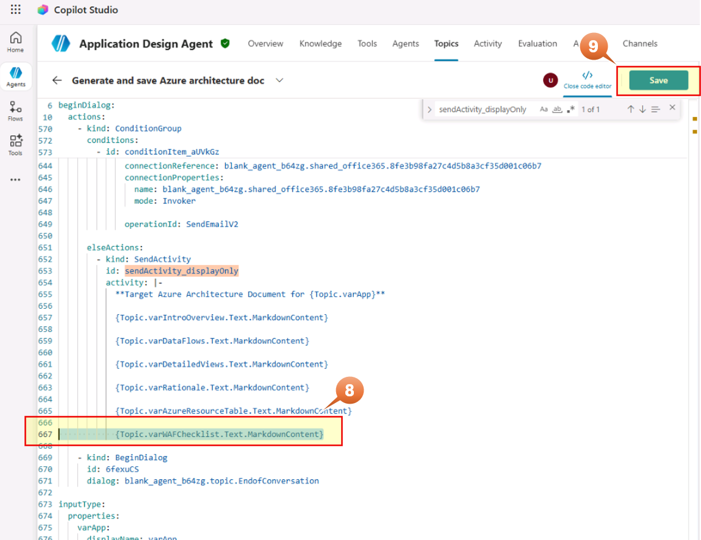

10. Start a New Test Session in the chat window to test the new feature as shown in the Image

    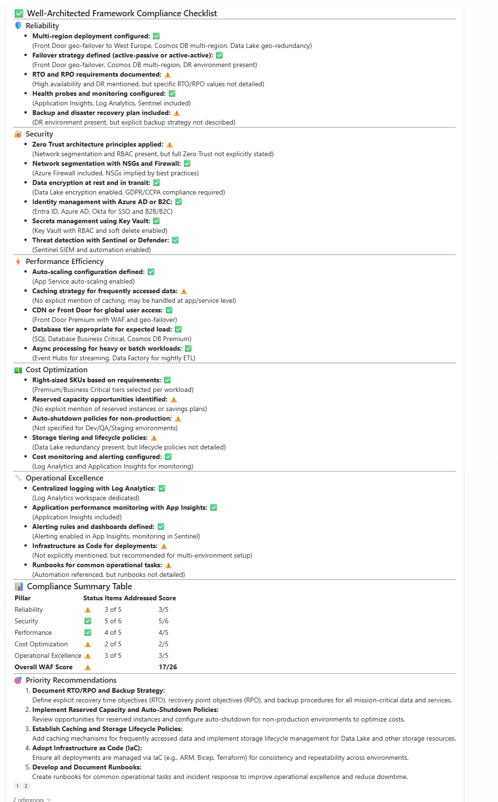

