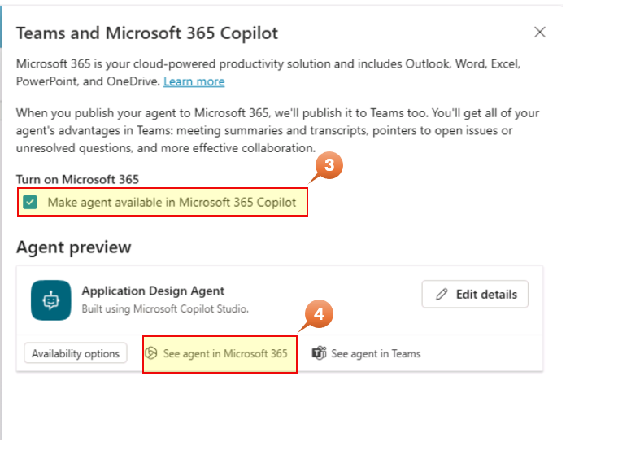
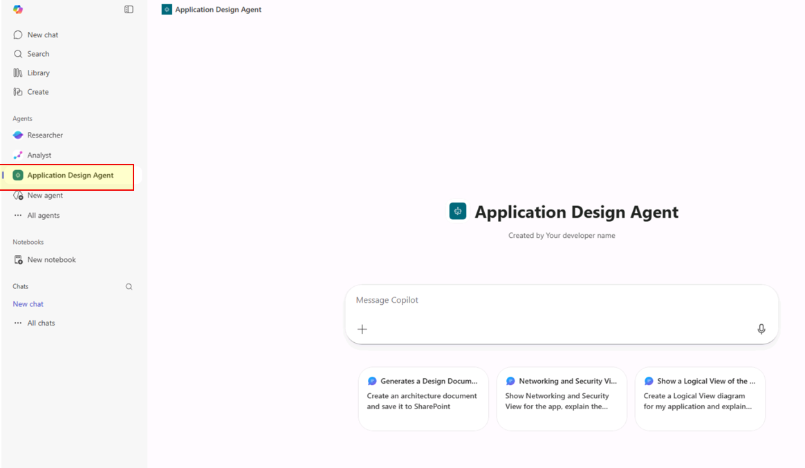

# Module 9: Publishing to Channels (3 minutes)

Once you have configured and tested the Design Agent, you can publish it to various channels to make it accessible to architects and consultants across your organization.

## Step 9.1: Understanding Channels

Copilot Studio supports publishing to multiple channels:

| Channel                   | Use Case                  | Audience                |
| ------------------------- | ------------------------- | ----------------------- |
| **Microsoft Teams**       | Internal collaboration    | Architects, Consultants |
| **SharePoint**            | Embedded in project sites | Project teams           |
| **Power Apps**            | Custom applications       | Field consultants       |
| **Web (Demo Website)**    | External demos            | Customer presentations  |
| **Azure Bot Service**     | Custom integrations       | Developers              |
| **Microsoft 365 Copilot** | Copilot integration       | Enterprise users        |

## Step 9.2: Publish the Agent

Before publishing to any channel, you must first publish the agent:

1. In Copilot Studio, open the **Application Design Agent**
2. Click the **Publish** button in the top-right corner
3. Review the publish summary:
   - Topics included
   - Knowledge sources
   - Connections configured
4. Click **Publish**
5. Wait for confirmation: "Your agent is published"

**Important:** You must republish the agent whenever you make changes to topics, knowledge, or settings.

## Step 9.3: Publish to Microsoft 365 Copilot

For organizations with Microsoft 365 Copilot, the Design Agent can be integrated as a plugin.

1. Go to **Channels** > **Microsoft 365 Copilot**
2. Click **Teams and Microsfot 365 Copilot**
3. Keep checked _Make agent available in Microosft 365 Copilot_
4. Click on **See agent in Microsoft 365**

   

5. Click on **Add** to publish the agent to M365 Copilot

   

> **Note:** The agent will request to connect the connections
